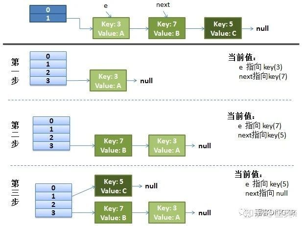
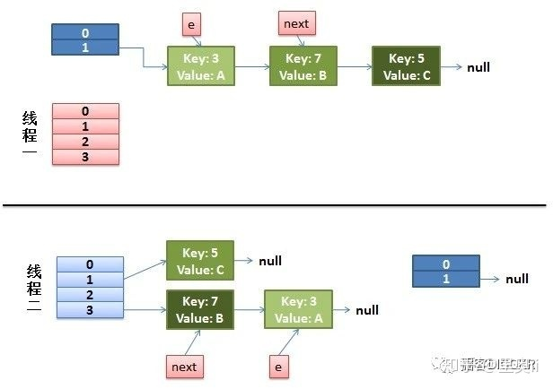
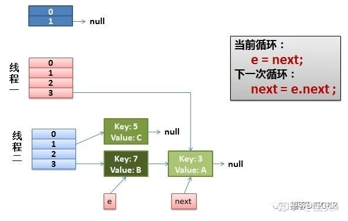
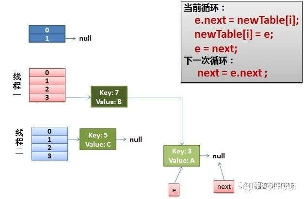
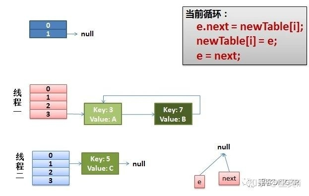
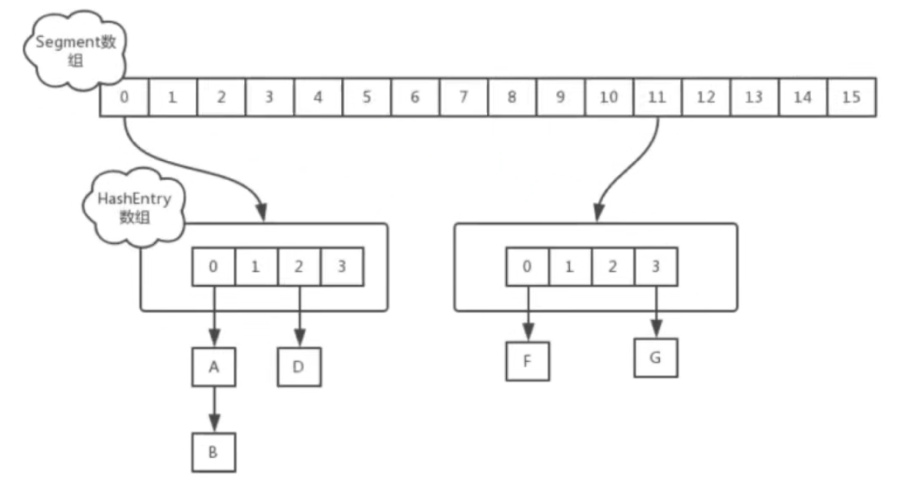

## HashMap原理

JDK1.7  HashMap=Hash函数+数组+链表 头插法

JDK1.8  HashMap=Hash函数+数组+链表 尾插法（超过8变成红黑树）  其实性能提升不是特别大（大约8%）

默认负载因子0.75  **初始默认容量为16** 2倍扩容

> **为什么槽位要用2的幂次？**  **2倍扩容？**
> 
> 因为每次hash要取余定下标，取余运算在CPU处理中是最麻烦的一种  加减>乘除>取余
> 
> 而用2的幂次  取余操作等价于求一次位运算 hashcode % len == hashcode &（len-1）有点像求反掩码
> 
> 像这种底层的频繁操作 put与rehash的时候，要在性能上斤斤计较 能省就省

简单证明一下为什么len为2的幂次时,取模操作相当于与运算

假设hashcode为1101 0101(2)   当len=16时 MASK=len-1=15 = 1111(2)

```
     1101 0101
&         1111
-----------------
       0000 0101
```

hashcode与len取余 由取余运算的性质可以把hashcode二进制展开(hashcode=2^n^+2^n-1^+2^n-2^+2^n-3^+…+2^0^)

hashcode二进制表示中高位的1,与len取余一定是为0的,假设高位的1(假设这里为第8个1 位权为2^7 其十进制为2^7=128)代表的数为k,它在数值上等于len(这里假设为16 2^4)左移了n位而来, 那么有k=len<<n=len*2^n^

k是len的整数倍 取余肯定为0 

> **负载因子为什么要是0.75**
> 
> 是为了平衡时空开销，设小了 容易频繁地hash碰撞，导致链表or红黑树长度过大 时间复杂度退化
> 
> 设大了  浪费空间

> **为什么超过8才转红黑树？**
> 
> 红黑树的维护成本也是很高的，要左右旋嘛。  如果链表长度不高没必要转红黑树。
> 
> 为什么阈值是8？ 答案是用泊松分布（单位时间源源来流的粒子数量）算出来的，虽然不知道推导过程但是用泊松分布去推 听上去似乎非常合理
> 
> 其结果就是 当这个阈值为8的时候，转红黑树是一个极小概率的事件（大概是小数点后6、7个0的概率）  

> **为什么要用头插法？，带来了什么问题**
> 
> 可能是根据程序局部性的原理，觉得最后放入map的数据可能很快就会用到，但带来的问题就是在并发的情况下有可能造成循环链表的问题（<=JDK1.7） 具体是在resize转移元素的时候 线程不安全。
> 
> 于是在>=1.8以后Sun进行了改进，改用了尾插法。

### 环形链表问题([原文](https://zhuanlan.zhihu.com/p/200997545))

**正常的Rehash的过程：**



**并发下的Rehash过程：**

1. 假设我们有两个线程，用红色和浅蓝色标注了一下。

我们再回头看一下transfer代码中的这个细节：

```java
do {
   Entry<K,V> next = e.next; //假设线程一执行到这里就被调度挂起了
    int i = indexFor(e.hash, newCapacity);
    e.next = newTable[i];
    newTable[i] = e;
    e = next;
} while (e != null);
```

而我们的线程二执行完成了。于是我们有下面的这个样子。



注意，因为Thread1的 e 指向了key(3)，而next指向了key(7)，其在线程二rehash后，指向了线程二重组后的链表。我们可以看到链表的顺序被反转了。

2. 线程一被调度回来执行

先是执行 newTalbe[i] = e；然后是e = next，导致了e指向了key(7)，而下一次循环的next = e.next导致了next指向了key(3)



3. 一切安好

线程一接着工作。把key(7)摘下来，放到newTable[i]的第一个，然后把e和next往下移。



4. 环形链表出现

e.next = newTable[i] 导致 key(3).next 指向了 key(7)

注意：此时的key(7).next 已经指向了key(3)， 环形链表就这样出现了。



于是，当我们的线程一调用到，HashTable.get(11)时，悲剧就出现了Infinite Loop，会一直循环遍历,CPU使用率飙升。

有人把这个问题报给了Sun，不过Sun不认为这是一个问题。因为HashMap本来就不支持并发，要并发就用ConcurrentHashmap。

## HashTable与HashMap的区别？

1. Hashtable不允许null值
2. **Hashtable是线程安全的**

但是Hashtable的线程安全代价太大了，它的实现非常简单粗暴：把整个Hashtable上了一个大锁(指在get与set方法上加上synchronized修饰)，相当于串行化了，并发情况下的性能就会非常差。

## ConcurrentHashmap的特点

线程安全的hashmap

双层数组  第一层为segement数组，第二层为Hashentry数组  在第二层的Hashentry数组里使用put会加锁。

put的时候首先计算落在哪个segement对象上, 然后再将segment对象的entry数组上锁,存到entry数组里


