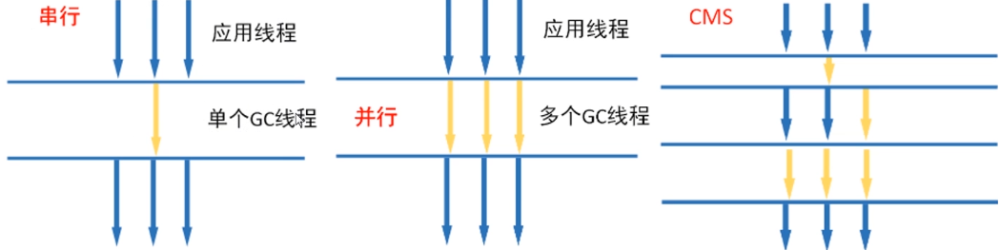
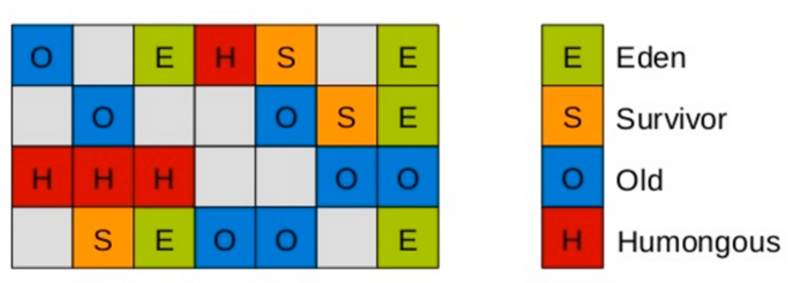
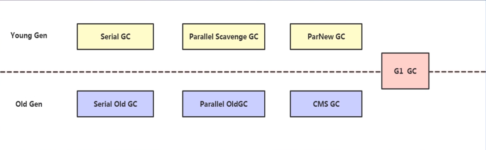
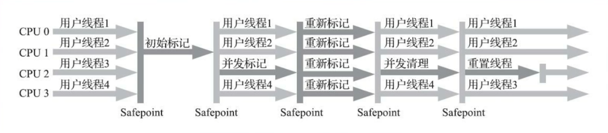
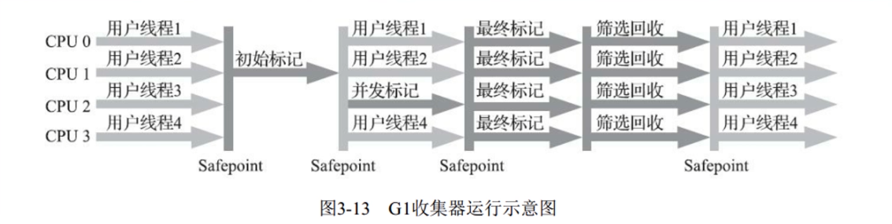
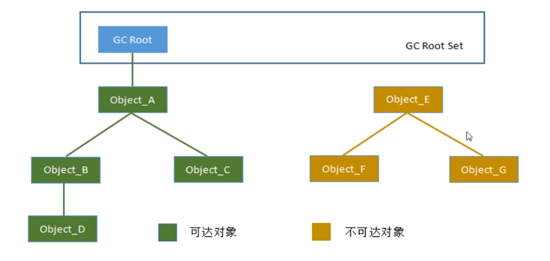
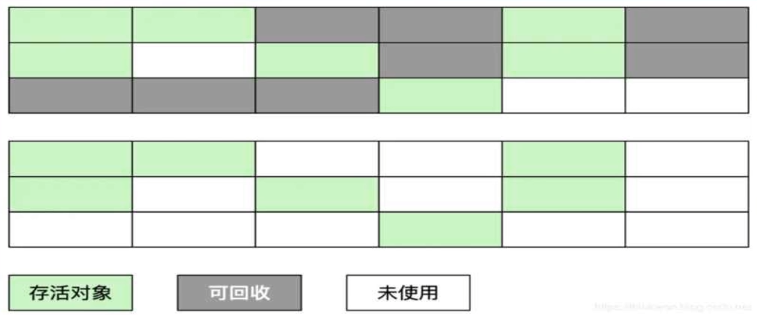
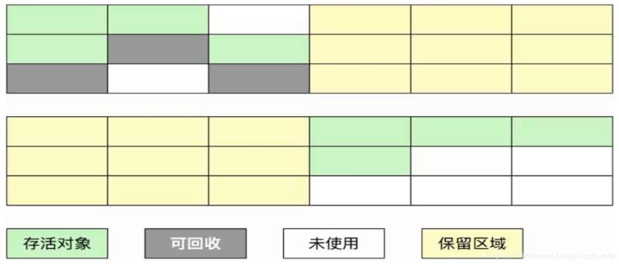
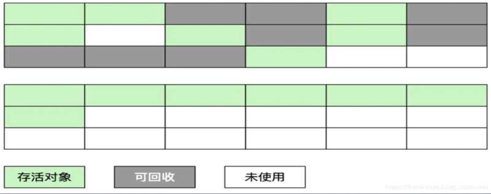

```yaml
title: Java垃圾回收算法
time: 2022-05-13
categories: 垃圾回收算法
tag: Java GC
```
#垃圾回收

# Java垃圾回收算法

## 垃圾回收器&&垃圾回收算法

### 垃圾回收器

垃圾回收算法主要分为两个部分: 

1. 判断对象是否已经死亡的算法  

2. 回收的算法

而垃圾回收器则是对垃圾回收算法的实现


串行&&并行:  都会暂停所有的用户线程STW, 并行快一些 相较于串行回收,更适合大数据量的情景


并发CMS(Concurrent Mark Sweep):




G1: 堆内存分割成不同区域, 并发地进行回收




按照工作的区域可以分为(记住G1是可以跨代的):



新生代垃圾收集器:Serial 、 ParNew 、Parallel Scavenge

老年代垃圾收集器:Serial Old 、Parallel Old 、CMS

整堆收集器:G1


### 并行垃圾收集器(吞吐量优先):

#### ParNew收集器

ParNew收集器实质上是Seria收集器的多线程并行版本，除了同时使用多条线程进行垃圾收集之外,其余的行为包括Seria收集器可用的所有控制参数、收集算法、Stop The World、对象分配规则、回收策略等都与Seria收集器完全一致，在实现上这两种收集器也共用了相当多的代码。

#### Parallel Scavenge收集器

又称为吞吐量优先收集器，和ParNew收集器类似，是一个新生代收集器。使用复制算法的并行多线程收窠器。Parallel Scavenge是Java1.8默认的吸集器，特点是并行的多线程回收，以春吐量优先。

#### Parallel Old收集器

Parallel Old是Parallel Scavenge收集器的老年代版本，支持多线程并发收集，基于标记-整理算法实现。这个收集器是直到JDK6时才开始提供的，在此之前，新生代的Parallel Scavenge收集器一直处于相当尴尬的状态．原因是如果新生代选择了Parallel Scavenge收集器，老年代除了SerialOid 收集器以外别无选择．其他表现良好的老年代收集器，如CMS无法与它配合工作。


### CMS垃圾回收(停顿时间优先)

CMS (Concurrent Mark Sweep)是以获取最短垃圾收集停顿时间为目标的收集器，CMS收集器的关注点尽可能缩短垃圾收集时用户线程的停顿时间,停顿时间越短就越适合与用户交互的程序,在互联网的B/S系统服务器上的应用尤其注重服务器的响应速度，系统停顿时间最短，给用户带来良好的体验，CMS收集器使用的算法是标记-清除算法实现的。


#### CMS垃圾回收过程



- **初始标记(Initial-Mark)**阶段:这个阶段程序所有的工作线程都将会因为"Stop-the-Wold"机制而出现短暂的的暂停,这个阶段的主要任务标记处GC Roots 能够关联到的对象.一旦标记完成后就恢复之前被暂停的的所有应用。由于直接关联对象比较小，所以这里的操作速度非常快。

- **并发标记(Concurrent-Mark)**阶段:从GC Roots的直接关联对象开始遍历整个对象图的过程,这个过程耗时较长，但是不需要暂停用户线程,用户线程可以与垃圾回收器一起运行。
- **重新标记(Remark)**阶段:由于并发标记阶段，程序的工作线程会和垃圾收集线程同时运行或者交叉运行，因此,为了修正并发标记期间因为用户继续运行而导致标记产生变动的那一部分对象的标记记录，这个阶段的停顿时间通常比初始标记阶段长一些，但也远比并发标记阶段时间短。
- **并发清理(Concurrent-Sweep)**阶段:此阶段清理删除掉哪了标记的判断已经死亡的对象,并释放内存空间。由于不需要移动存活对象，所以这个阶段可以与用户线程同时并发运行。


#### 缺点:

1. CMS收集器对CPU资源非常敏感。
2. CMS收集器无法处理浮动垃圾，可能出现"Concurrent Mode Failure"失败而导致另一次FullGC的产生。

3. 空间碎片:CMS是一款基于标记-清除算法实现的收集器，所有会有空间碎片的现象。


### G1垃圾回收(兼顾吞吐量与停顿时间)

Garbage First是一款面向服务端应用的垃圾收集器，主要针对配备多核CPU及大容量内存的机器，以极高概率满足GC停顿时间的同时，还兼具高吞吐量的性能特征。





**初始标记**:和CMS一样只标记GC Roots直接关联的对象

**并发标记**:进行GC Roots Traceing过程
**最终标记**:修正并发标记期间,因程序运行导致发生变化的那一部分对象

**筛选回收**:根据时间来进行价值最大化收集


#### G1的优点

1. G1把内存划分为多个独立的区域Region
2. G1仍然保留分代思想,保留了新生代和老年代,但他们不再是物理隔离,而是一部分Region的集合
3. G1能够充分利用多CPU、多核环境硬件优势，尽量缩短STW
4. G1整体整体采用标记整理算法,局部是采用复制算法,不会产生内存碎片
5. G1的停顿可预测,能够明确指定在一个时间段内,消耗在垃圾收集上的时间不超过设置时间
6. G1跟踪各个Region里面垃圾的价值大小,会维护一个优先列表,每次根据允许的时间来回收价值最大的区域,从而保证在有限时间内高效的收集垃圾


## 面试题

一般三条主线

- 什么是垃圾回收?
     垃圾回收中如何判断对象已死?可以作为GC Root的对象有哪些?

- 谈谈对分代回收的理解?

     GC的类型有哪些?
     Minor GC和 Full GC触发条件?

- JVM有哪些垃圾回收算法?

     JVM各种垃圾回收算法的优缺点?


### 什么是垃圾回收?

垃圾回收GC: Java程序会不定时地被唤起检查是否有不再被使用的对象，并释放它们占用的内存空间。

垃圾回收需要完成的三件事情:

- 哪些内存需要回收
- 什么时候回收
- 如何回收

#### 如何判断哪些内存需要回收

##### 引用计数法

给每个创建的对象添加一个引用计数器，每当此对象被某个地方引用时，计数值+1，引用失效时-1，所以当计数值为0时表示对象已经不能被使用。引用计数算法大多数情况下是个比较不错的算法，简单直接判定效率高，但它很难解决对象直接相互循环引用的问题。  

因为在面向对象的编程语言里 对象的行为是交给程序员去定义的,并不是确定的。而像Redis这样的Nosql就可以用引用计数法来判定对象是否过期。


##### 可达性分析法

搜索引用链，需要用到的对象必然有引用，对其引用链进行遍历，可达的对象不回收（因为可能还要用到），不可达的对象就回收掉。




###### 可以作为GC Root的对象

**1.Java虚拟机栈(栈帧中的局部变量表)中的引用所引用的对象**

**2.本地方法栈中JNI(Native方法)引用的对象**

**3.方法区中类静态属性引用的对象**
**4.方法区中常量引用的对象**
5.Java虚拟机内部的引用，如基本数据类型对应的Class对象，一些常驻的异常对象（比如NullPointExcepiton、OutOfMemoryError)
6.所有被同步锁(synchronized关键字)持有的对象
7.反映Java虚拟机内部情况的JMXBean、JVMTI(JVM Tool Interface)中注册的回调、本地代码缓存等


### 谈谈对分代回收的理解?

根据对象的生命周期将内存划分，然后进行分区管理。当前商业虚拟机的垃圾收集器，大多数都遵循了“分代收集”(Generational Collection)的理论进行设计。

分代收集名为理论：
实质是一套符合大多数程序运行实际情况的经验法则，它建立在两个分代假说之上:

1) **弱分代假说（Weak Generational Hypothesis)︰绝大多数对象都是朝生夕灭的。**
2) **强分代假说(Strong Generational Hypothesis) :熬过越多次垃圾收集过程的对象就越难以消亡。**


#### 按照对堆的划分，在哪个分区进行GC，可以将垃圾回收算法分为

- 部分收集（Partial GC)︰指目标不是完整收集整个Java堆的垃圾收集，其中又分为
  - 新生代收集(Minor GC/Young GC)︰指目标只是新生代的垃圾收集。
  - 老年代收集(Major GC/old GC)︰ 指目标只是老年代的垃圾收集，目前只有CMS收集器会有单独收集老年代的行为。
  - 混合收集(Mixed GC):指目标是收集整个新生代以及部分老年代的垃圾收集。目前只有G1收集器会有这种行为。
- 整堆收集（(Full GC):收集整个Java堆和方法区的垃圾收集


#### Minor GC和 Full GC触发条件?

Minor GC触发条件:
当Eden区满时触发Minor GC,Minor GC会引发STW(stop the world)。

Full GC触发条件:
(1）调用System.gc时，系统建议执行Full GC，但是不必然执行(2）老年代空间不足
(3）方法区空间不足
(4)通过Minor GC后进入老年代的平均大小大于老年代的可用内存


### 垃圾回收算法及其分类

**标记-清除算法**
标记无用对象，然后进行清除回收
**标记-复制算法**
按照容量划分二个大小相等的内存区域，当一块用完的时候将活着的对象复制到另一块上，然后再把已使用的内存空间一次清理掉。
**标记-整理算法**
标记无用对象，让所有存活的对象都向一端移动，然后直接清除掉端边界以外的内存


#### 标记-清除 算法（最基本的算法）




标记无用对象，然后进行清除回收。标记-清除算法(Mark-Sweep）将垃圾收集分为两个阶段∶

标记阶段:标记出可以回收的对象。

清除阶段:回收被标记的对象所占用的空间。


标记-清除算法之所以是基础的，是因为后面讲到的垃圾收集算法都是在此算法的基础上进行改进的。

优点:实现简单，不需要对象进行移动。
缺点:**标记、清除过程效率低，产生大量不连续的内存碎片**，提高了垃圾回收的频率。


#### 标记-复制 算法（一般用在新生代）



为了解决标记-清除算法的效率不高的问题，产生了复制(Copying)算法。

它把内存空间划为两个相等的区域，每次只使用其中一个区域。垃圾收集时，遍历当前使用的区域，把存活对象复制到另外一个区域中，最后将当前使用的区域的可回收的对象进行回收。


优点:按顺序分配内存即可，实现简单、运行高效，不用考虑内存碎片。

缺点:**可用的内存大小缩小为原来的一半，对象存活率高时会频繁进行复制。**


正是因为新生代的对象往往是朝生夕灭的，对象存活率不高，在这个分区使用标记-复制算法并不会引发频繁的复制行为


#### 标记-整理 算法（一般用在老年代）



与标记-清除算法不同的是，在标记可回收的对象后将所有存活的对象压缩到内存的一端，使他们紧凑的排列在一起，然后对端边界以外的内存进行回收。回收后，已用和未用的内存都各自一边。


优点:解决了标记-清理算法存在的内存碎片问题。
缺点:仍需要进行局部对象移动，一定程度上降低了效率。


