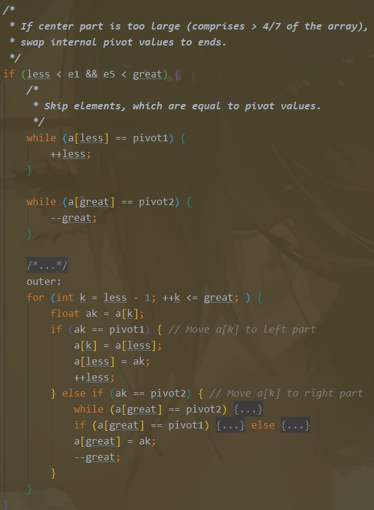

# 扒一扒Java双轴快排的源码

Java的快排其实是一个混合排序,依照数据量的多少与类型有不同的排序算法。 自己也简单实现了一下双轴快排，总结了一下双轴快排的优化<!--more-->

## 混合排序

Java的DualPivotQuicksort中定义了这样几个常数

```java
    /**
     * If the length of an array to be sorted is less than this
     * constant, Quicksort is used in preference to merge sort.
     */
    private static final int QUICKSORT_THRESHOLD = 286;

    /**
     * If the length of an array to be sorted is less than this
     * constant, insertion sort is used in preference to Quicksort.
     */
    private static final int INSERTION_SORT_THRESHOLD = 47;

    /**
     * If the length of a byte array to be sorted is greater than this
     * constant, counting sort is used in preference to insertion sort.
     */
    private static final int COUNTING_SORT_THRESHOLD_FOR_BYTE = 29;

    /**
     * If the length of a short or char array to be sorted is greater
     * than this constant, counting sort is used in preference to Quicksort.
     */
    private static final int COUNTING_SORT_THRESHOLD_FOR_SHORT_OR_CHAR = 3200;
```

翻译翻译：

按需要排序的数组长度划分  [0,29]：计数排序  [30,47)：插入排序  [47,286)：归并排序 

\>=286双轴快排

特别地，如果都是short or char 即小整数（<=255） 若数据量小于3200 用计数排序


这些阈值的选取应该都是基于大量input的经验数据


快排是基于递归算法的，递归需要压栈与弹出，如果数据量小，频繁push与pop的开销就比顺序遍历还大，得不偿失。因此需要对数据量分类讨论，确定选择什么排序算法。

Ps:直接插排是O(n^2)的复杂度，但是基于插排的改进算法  如二分插排，希尔排序都是O(NlogN)的复杂度，在源码里用的是二分插排

## 双轴快排的核心代码


1. 判断是否使用插入排序； 

2. 寻找六个元素，将整个数组分为近似七段，这六个元素之间用插入排序先排一次顺序

seventh并不是严格的length/7 ，这六个元素的位置是用大量的输入验证过的，是一个“经验位置”

![[image-20220515105331845.png]]

3. 如果寻找到的六个元素相邻的元素都不相同，则执行双轴快排，否则进行经典的单轴快排

```
if (a[e1] != a[e2] && a[e2] != a[e3] && a[e3] != a[e4] && a[e4] != a[e5]) //双轴快排
```


找到第二和第四号元素的位置，将两端（数组的第一个元素与最后一个）换入，并收缩less与great界限，使得左边less左边的元素都小于e2，great右边的元素都大于e4

```java
//定义两个轴为e2与e4元素的位置(将数组近似地三等分)
float pivot1 = a[e2];
float pivot2 = a[e4];
//两端换入
a[e2] = a[left];
a[e4] = a[right];
//收缩界限
while (a[++less] < pivot1);
while (a[--great] > pivot2);
```

收缩过后数组大约是这样的

```
/*
 * Partitioning:
 *
 *   left part              center part                                right part
 * +--------------------------------------------------------------+
 * |  < pivot1  |  pivot1 <= && <= pivot2  |    ?    |  > pivot2  |
 * +--------------------------------------------------------------+
 *                ^                                                    ^        ^
 *                 |                                                     |          |
 *               less                                                  k       great
 *
 * Invariants:
 *
 *              all in (left, less)   < pivot1
 *    pivot1 <= all in [less, k)     <= pivot2
 *              all in (great, right) > pivot2
 *
 * Pointer k is the first index of ?-part.
 */
```


将原数组分成了三个区，遍历中间的区域（center part） 将小于pivot1的元素换到左边，将大于pivot2的元素换到右边

分区核心代码（partitioning）：

```java
            outer:
            for (int k = less - 1; ++k <= great; ) {
                float ak = a[k];
                if (ak < pivot1) { // Move a[k] to left part
                    a[k] = a[less];
                    /*
                     * Here and below we use "a[i] = b; i++;" instead
                     * of "a[i++] = b;" due to performance issue.    
                     */
                    //出于性能考虑，这样写
                    a[less] = ak;
                    ++less;
                } else if (ak > pivot2) { // Move a[k] to right part
                    while (a[great] > pivot2) {
                        if (great-- == k) {
                            break outer;
                        }
                    }
                    if (a[great] < pivot1) { // a[great] <= pivot2
                        a[k] = a[less];
                        a[less] = a[great];
                        ++less;
                    } else { // pivot1 <= a[great] <= pivot2
                        a[k] = a[great];
                    }
                    a[great] = ak;
                    --great;
                }
            }
```

最后将两个轴换入到响应位置，递归地在左中右三个分区进行快排

```java
// Swap pivots into their final positions
a[left]  = a[less  - 1]; a[less  - 1] = pivot1;
a[right] = a[great + 1]; a[great + 1] = pivot2;

// Sort left and right parts recursively, excluding known pivots
sort(a, left, less - 2, leftmost);
sort(a, great + 2, right, false);            
// Sort center part recursively
sort(a, less, great, false);
```


特别地：如果中间区域过大（大于数组长度的4/7），可以进一步地限制中间区域长度，具体做法是将中间区域等于pivot1移到左边，等于pivot2移到右边，相当于将等于轴的值不纳入中间区域的排序



中间区域搜索后大致是这样的

```
* Partitioning:
*
*   left part         center part                  right part
* +----------------------------------------------------------+
* | == pivot1 |  pivot1 < && < pivot2  |    ?    | == pivot2 |
* +----------------------------------------------------------+
*                ^                                              ^       ^
*                 |                                               |         |
*                less                                           k     great
*
* Invariants:
*
*              all in (*,  less) == pivot1
*     pivot1 < all in [less,  k)  < pivot2
*              all in (great, *) == pivot2
*
* Pointer k is the first index of ? - part.
```


## 自己实现一个双轴快排

自己实现的话，不需要考虑那么多的优化问题，代码相对简洁，领会双轴快排思想即可

要注意一些边界问题，手撕代码要小心。

```java
/**
   * 调用入口
   * @param arr 需要排序的数组
   */
  public void quickSort(int[] arr){
      dualPivotQuickSort(arr,0,arr.length-1);
  }
 
  /**
   * 双轴快速排序的核心算法
   * @param arr       需要排序的数组
   * @param start     排序的开始位置
   * @param end       排序的结束位置
   */
  public void dualPivotQuickSort(int[] arr,int start,int end){
      //如果数量太少则直接采用经典的单轴快排
      if (end-start < 64) {
          qSort(arr,start,end);
          return;
      }
 
      //双轴快排核心
      int low =start++;
      int high = end--;
      //先排序前面6个元素
      qSort(arr,low,low+5);
      //初始化双轴的2个基数
      swap(arr,low,low+1);
      swap(arr,high,low+3);
      int pivotLow =arr[low],pivotHigh =arr[high];
      int lowIndex =low+1,highIndex=high-1;
 
      //基于pivot划分位置
      while (start < end){
          //小于左边基数
          if (arr[start] < pivotLow){
              swap(arr,start++,lowIndex++);
          }
          //大于右边基数
          else if(arr[start] > pivotHigh){
              swap(arr,start,highIndex--);
              end--;
          }
          //位置2个基数中间
          else{
              start++;
          }
      }
      //修正基数位置
      --lowIndex;
      if (arr[highIndex] < pivotLow ) {
          swap(arr,low,highIndex);
      }else if (arr[highIndex] >= pivotHigh){
          --highIndex;
      }
      //继续划分更小
      dualPivotQuickSort(arr,low,lowIndex);//左边
      dualPivotQuickSort(arr,lowIndex+1,highIndex);//中间
      dualPivotQuickSort(arr,highIndex+1,high);//右边
  }
```


## 双轴快排到底优化了什么（总结）

单轴快排的小问题:

1. 对轴的选取的问题，如果选得不好会直接退化到O(n^2)的复杂度，而且递归深度大大增加。

   具体来说，比如每次选取末尾元素为轴，而整个原始数组都是升序的，每次只能确定一个元素的位置，递归深度为N，遍历次数N(N-1)/2

2. 轴选取得不好，两边划分得不够平均，则递归树会很不平衡，甚至退化成链表。

3. 数据量小的情况下，递归的开销比顺序遍历大。


双轴快排的优化

1. 每次可以确定两个元素的位置（甚至更多，与轴相同的元素位置都可以确定）

2. 轴的选取更有随机性，却没有引入随机的开销。

   2.1 为了避免单轴快排 排一个升序数组 复杂度退化到O(n^2)的情况，可以先shuffle一下原数组，这样你的时间复杂度开销会增加一个O(n)

   2.2 也可以每次确定轴的时候使用rand来确定，但是在程序中引入随机数是一种不提倡的行为：因为不好定位bug，你的bug很可能无法重现，特别是在语言源码层面，你的代码是会给千千万万开发者使用的。

3. 划分得更平均了，每次几乎可以划分为三等分，避免了递归过深

4. 依据数据量的大小使用了不同的排序策略


## 看源码时发现的一个我以前没有注意到的语法知识

Java其实是有label的，但是**Java的label只用于多重循环的break与continue**， 比如你想要在多重循环中直接跳出所有的循环，可以在最外层的循环上打一个label，然后在跳出循环的位置 break label

注意，这个label只能打在循环之前（for while语句的前一句的位置） 具体执不执行这个label所在的循环 要看是`break label`还是`continue label`

可以参考这篇stackOverflow（我应该如何跳出内嵌循环呢？）：

[How do I break out of nested loops in Java? - Stack Overflow](https://stackoverflow.com/questions/886955/how-do-i-break-out-of-nested-loops-in-java)

