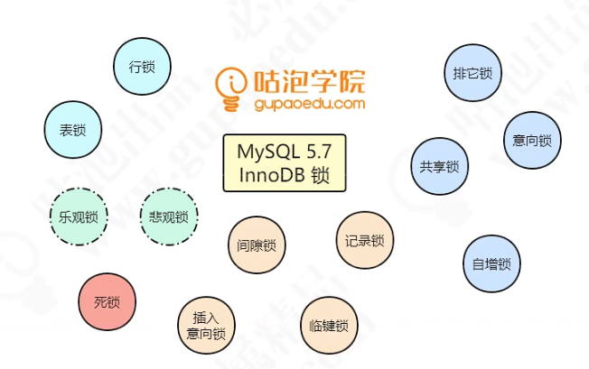
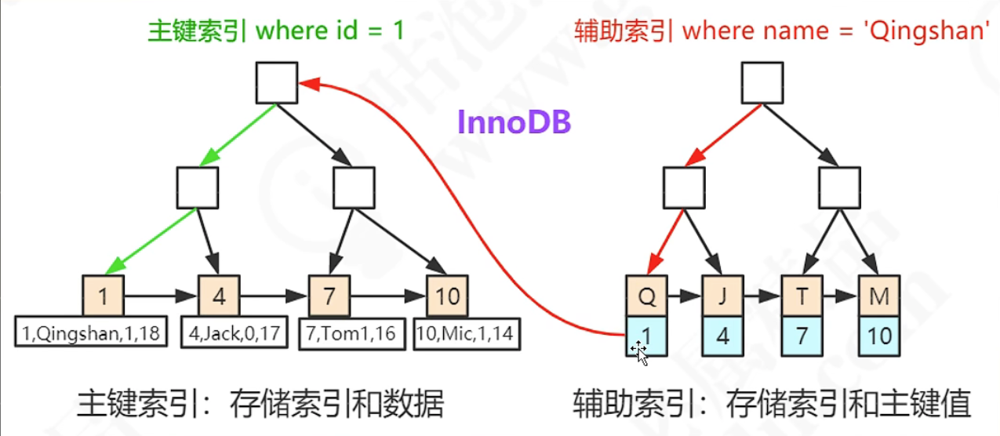

# Mysql常用知识

## 事务与锁

注意锁按照分类标准不同  有不同的名称

>MYSQL锁机制Ref:[MySQL :: MySQL 8.0 Reference Manual :: 15.7.1 InnoDB Locking](https://dev.mysql.com/doc/refman/8.0/en/innodb-locking.html#innodb-shared-exclusive-locks)

根据锁的粒度来划分： 行锁  or  表锁

根据锁的类型来划分： 排他锁（X锁 exclusive lock写锁） 共享锁（S锁 share lock 读锁） 意向锁（理解成一种标志位就好  表示在更细的粒度上有锁）

> 索引锁的是什么？锁在字段上 还是行上？

其实是锁在聚集索引上,在innoDB_LOCKS表中 有一个字段专门显示lock_inex

值得注意的是 如果该表没有显式的建立主键索引 或者唯一索引，那么默认用row_id 来充当聚集索引  这个时候就会“锁表”

聚集索引可能是

1. 主键索引 primary key
2. 唯一索引 unique key not NULL
3. row_id 一个隐藏字段   每张表都必然有三个隐藏字段  row_id tx_id roll_ptr （MVCC）

聚集索引决定数据存放的顺序，一张表必然有聚集索引！

非聚集索引（英文 secondary Index 直译为二级索引）

类似于中文字典  可以用拼音查 也可以用部首查，但它的数据存储顺序是按照拼音的顺序（字典序）来的

二级索引查找到主键索引后 通过主键索引去查数据（回表）

 

> InnoDB是怎样解决幻读问题的？
