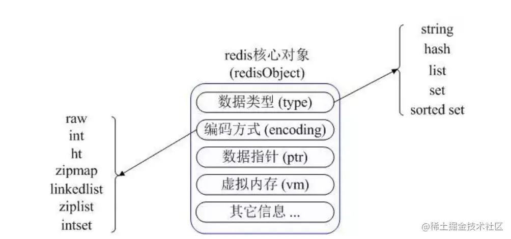
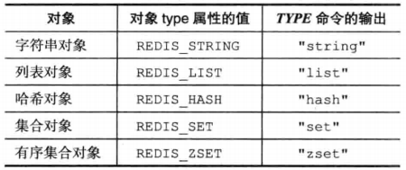
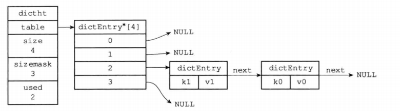
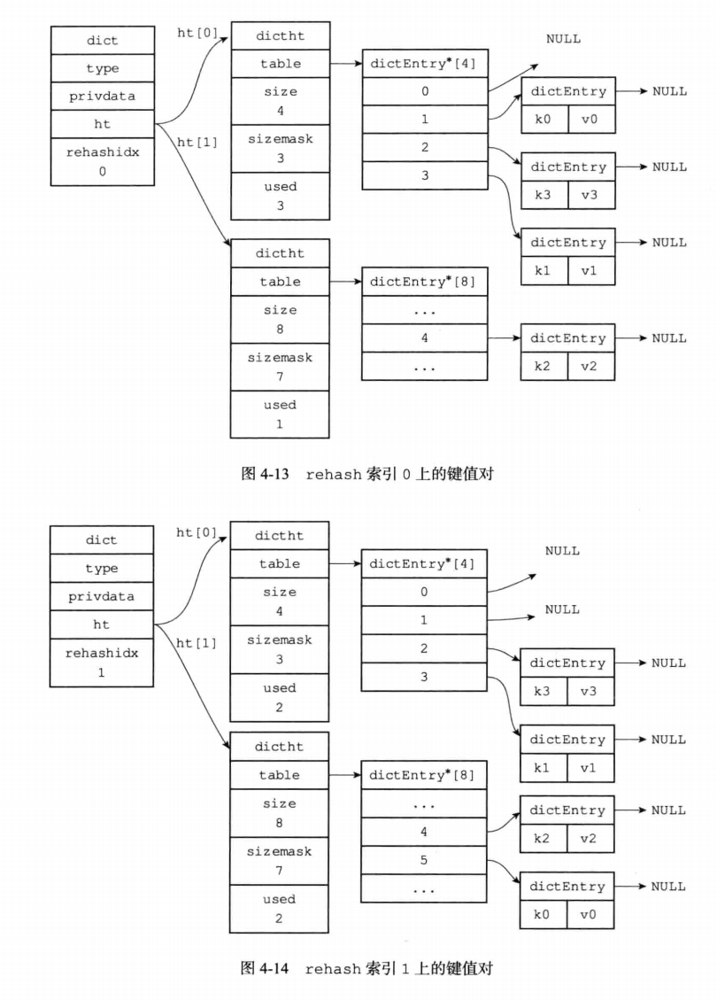
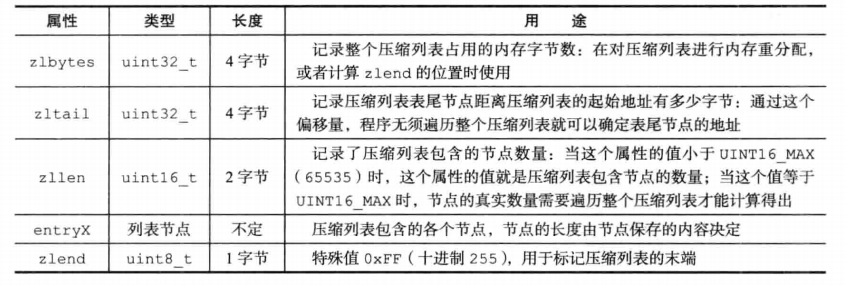
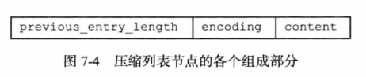
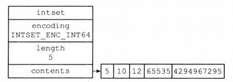

## Redis的数据结构与编码方式



redis有五大数据类型（五大对象）： string hash list set sortedSet， 但是redis构建了一个简单的对象系统， 每种对象使用了多种数据结构来实现。并实现了基于引用计数的GC。
redis是基于KV的NoSQL， 其中的键必然是一个String对象，而值可以是五大数据类型之一（String、Hash、List、Set、SortedSet）




## 常见的底层数据结构

### SDS（Simple Dynamic String）embstr的实现

```cpp
struct sdshdr{
    int len;   //记录string长度
    int free;  //记录没有分配的空间
    char buf[];   //二进制安全的buf数组
}
```

这样设计的好处 

1. O(1)获取String的长度

2. 二进制安全,虽然是string 但是图片等信息也可以存

3. **避免频繁地进行内存重分配**

4. **内存预分配,惰性空间释放**

避免重分配:当有预留空间没有使用时,优先使用预留的空间 而不用重新申请空间,  redis的场景中string可能频繁改动

内存预分配:先分配够用的,不够再扩容,类似于vector的实现

惰性空间释放: 在空间不足时,可以释放free记录的空间

### HashTable: 字典的实现方案

```cpp
typedef struct dictht{
    dicEntry **table;   //hash数组  每个entry都是一个hash槽

    unsigned long size;  //hash表大小

    unsigned long sizemask; //掩码

    unsigned long used;   //节点数量
}

typedef struct dict{
    dictType *type; //为了实现多态字典   记录一簇操作特定类型的键值对函数

    void *privateData; //为了实现多态字典  函数的可选参数

    dictht ht[2];  //两个hashtable  为了rehash

    int rehashIndex;  //记录rehash进行到哪里了  

}
```



拉链法解决hash冲突

**渐进式rehash**

hash表进行2的幂次扩容,hash表可能非常大,一次性扩容可能导致服务停止一段时间。 

所以使用渐进式rehash，每次取ht[0]中 rehashIndex指向的hash槽的元素进行rehash，添加到ht[1]中。然后rehashIndex++，进行下一个槽位的操作。

查找时先查找ht[0]再查找ht[1]，  新的插入直接插入ht[1]



### List： 双端带头链表

```cpp
//链表节点
typedef struct listNode{
    struct listNode *pre;
    struct listNode *next;
    void *val
}

typedef struct list{
    //头 尾  长度
    listNode *head;
    listNode *tail;
    unsigned long len;
    //节点复制函数
    void *(*dup) (void *ptr);
    //节点释放函数
    void *(*free) (void *ptr);
    //节点对比函数
    void *(*match) (void *ptr);
}
```

没啥好讲的。。

### zipList 压缩列表


当列表的数据量较小的时候，采用顺序存储比较省空间，而且遍历的时间复杂度是可以忍受的，那么优先采用压缩列表而不是双端链表。



一个压缩列表ZipList =  节点个数、尾节点地址、所占内存 + N个entry节点

而一个entry节点包括



previous_entry_len 记录上一个节点的长度，用于从后往前遍历； encoding记录当前节点的长度与数据类型；content记录数据内容。

### SkipList 跳表（有序集合的实现之一）


跳表是一种有序的数据结构，支持平均O(logN) ,最坏 O(N)的查找， 效率可以与平衡树媲美，但是实现更简单，在区间遍历上比红黑树优秀。

跳表的实现有点类似于**多层索引**，底层有序 逐层简历索引。

如果redis中的有序集合（zset）的成员较多，且为较长的字符串时，就会用跳表来实现。

层高是一个[1,32]之间的随机数。

具体介绍可以参考： [Skip List--跳表（全网最详细的跳表文章没有之一） - 简书 (jianshu.com)](https://www.jianshu.com/p/9d8296562806)

### intSet 整数集合

底层实现就是一个有序数组，返璞归真了属于是。

查找是二分查找，复杂度O(logN)。 更新删除O(N) 



## 编码类型与底层实现

### String对象的实现

1. 如果小于LONG_MAX的范围，可以用int来存储
2. 如果为浮点或数字太大， 可以用raw（即SDS）或embstr（SDS的对象形式）进行存储

### Hash对象的存储

数据量小用ziplist实现，数据量大转HashTable

具体来说，默认（可以修改）当

- K，V的长度都小于64字节

- 键值对的数量小于512时

使用zipList来省空间，否则转Hashtable

### List对象的存储

数据量小zipList 数据量大LinkedList

### Set对象的存储

元素数量<512 && 元素都是整数值  用intset编码

否则用Hashtable编码

### zSet对象的存储

当 元素数量<128 && 每个元素成员长度 < 64Byte 使用zipList编码 

否则使用 skipList编码