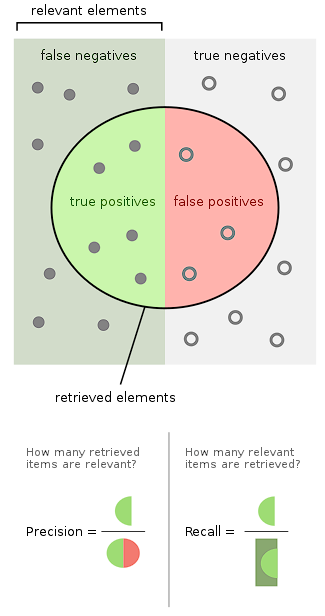

## Resource
youtube地址
https://www.youtube.com/watch?v=CCTgroOcyfM&list=PL_mJOmq4zsHZYAyK606y7wjQtC0aoE6Es&index=1

文档:
第一课
https://github.com/LisaHJung/Part-1-Intro-to-Elasticsearch-and-Kibana
第二课
https://github.com/LisaHJung/Part-2-Understanding-the-relevance-of-your-search-with-Elasticsearch-and-Kibana-
第三课
https://github.com/LisaHJung/Part-3-Running-full-text-queries-and-combined-queries-with-Elasticsearch-and-Kibana
第四课
https://github.com/LisaHJung/Part-4-Running-Aggregations-with-Elasticsearch-and-Kibana

ElasticSearch 是一个分布式的搜索引擎 可以搭配Kibana等ES系工具配套使用
ES环境搭建: 可以用这个dockerFile ,然后在本机的5601开Kibana即可完成学习环境的搭建
```xml
services:
  elasticsearch:
    image: docker.elastic.co/elasticsearch/elasticsearch:7.11.1
    container_name: elasticsearch
    #build: .
    ports:
      - '9200:9200'
      - '9300:9300'
    environment:
      discovery.type: single-node
      ES_JAVA_OPTS: -Xmx512m -Xms512m
      node.name: es01
      cluster.name: elasticsearch
    volumes:
      - /root/develop/tools/docker_files/elasticSearcha
    networks:
      - elasticnet

  kibana:
    image: docker.elastic.co/kibana/kibana:7.11.1
    container_name: kibana
    ports:
      - '5601:5601'
      - '9600:9600'
    environment:
      SERVERNAME: kibana
      ELASTICSEARCH_HOSTS: http://elasticsearch:9200
      ES_JAVA_OPTS: -Xmx512m -Xms512m
    networks:
      - elasticnet
    depends_on:
      - elasticsearch
volumes:
  logvolume01: {}

networks:
  elasticnet: {}
```

## 基础概念
### 查全率(Recall)与查准率(Precision)
如果一次搜索, 结果可以分为相关与不相关即relevant与unrelevant, 

Precision查准率是指, 所有你搜索到的结果中 有多少是相关的
Recall查全率是指, 搜索结果中相关样本数量 占总相关样本的多少
更数学化的方式:

被检索到为positive 反之为negative

结果正确为true 反之为false

|            |      正类      | 负类           |
| :--------: | :------------: | -------------- |
| **被检索** | True Positive  | False Positive |
| **未检索** | False Negative | True Negative  |

 那么:
$$
Precision=\frac{TP}{TP+FP}
$$

$$
Recall=\frac{TP}{TP+FN}
$$



这两个指标Precision和Recall, 往往是不能同时达到的

- 如果我们想要结果尽量精准 即搜索结果中相关的样本占搜索结果总量的比值高, 那么搜索结果的总量必然下降;

- 如果想要查全率高, 即搜索结果中相关的样本占总相关样本的比智高, 那么搜索的结果总量必然上升

故而, Precision与Recall是无法同时满足的


## 各种查询与聚合


