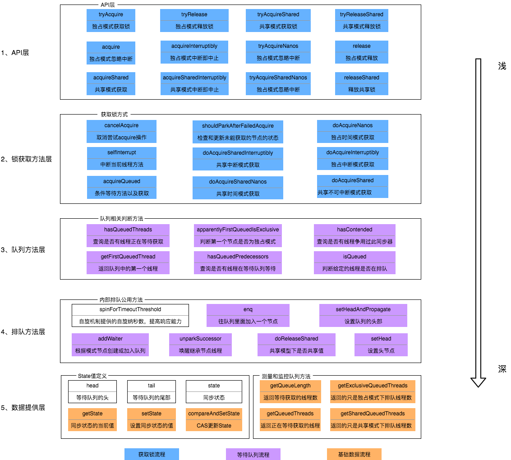
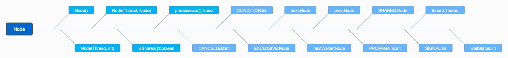

## 什么是AQS

abstract queueed synchronizer 抽象队列同步器。位于JUC下，是一个抽象类

以下都是基于AQS实现的，是一个JUC的基础类

- ReentrantLock（可重入锁）
- ReentrantReadWriteLock（读写锁）
- CountdownLatch
- Semaphore（信号量）
- Worker（ThreadPool下）

要做到通用, 那么就要开放一些方法让子类自己去覆写, 父类只管实现公用的代码

AQS的主要使⽤⽅式是继承，⼦类通过继承AQS并实现它的抽象⽅法来管理同步状态，同步器的
设计基于模板⽅法模式，所以如果要实现我们⾃⼰的同步⼯具类就需要覆盖其中⼏个可重写的⽅
法，如tryAcquire、tryReleaseShared等等。  


## AQS 的构成

设计这样一个基础类需要考虑的事情：

1. 要做到通用,无论子类是尝试获取锁 或是子类需要公平锁/非公平锁 都可以通过继承父类来实现，抽象出所有需要用的方法
2. 利用CAS，原子地修改竞争资源的标志位（一个资源能被几个线程使用需要一个标识）
3. 阻碍其它线程的调用，需要设计一个等待队列
    - 有的线程只是尝试一下获取对象，获取不到就算了
    - 有的线程就是想要获取到对象，获取不到它宁愿等待

实际上的实现也差不多, 我们需要一个状态量 通过CAS地修改这个状态量来表示当前竞态资源的状态;   我们需要一个排队的队列, 需要获取锁的线程来这个队列里排队 依次尝试获取锁以保证公平(非公平则直接CAS地竞争修改状态量即可)

AQS的构成如下(有颜色的为方法 无颜色的为属性)




### 同步状态state

```java
private volatile int state;
```


### 同步节点



一个节点里 记录了

| 方法和属性值 | 含义                                                         |
| :----------- | :----------------------------------------------------------- |
| waitStatus   | 当前节点在队列中的状态                                       |
| thread       | 表示处于该节点的线程                                         |
| prev         | 前驱指针                                                     |
| predecessor  | 返回前驱节点，没有的话抛出npe                                |
| nextWaiter   | 指向下一个处于CONDITION状态的节点（由于本篇文章不讲述Condition Queue队列，这个指针不多介绍） |
| next         | 后继指针                                                     |

一个Node里面只有三个属性: pre next status   分别表明前驱节点 后继结点  当前节点状态

status有如下状态 :

| 枚举      | 含义                                           |
| :-------- | :--------------------------------------------- |
| 0         | 当一个Node被初始化的时候的默认值               |
| CANCELLED | 为1，表示线程获取锁的请求已经取消了            |
| CONDITION | 为-2，表示节点在等待队列中，节点线程等待唤醒   |
| PROPAGATE | 为-3，当前线程处在SHARED情况下，该字段才会使用 |
| SIGNAL    | 为-1，表示线程已经准备好了，就等资源释放了     |


## ReentrantLock

ReentrantLock基于AQS，在并发编程中可以实现公平锁与非公平锁来对资源进行同步，同时与synchronized一样，reentrantLock支持可重入。除此之外ReentrantLock在调度上更加灵活