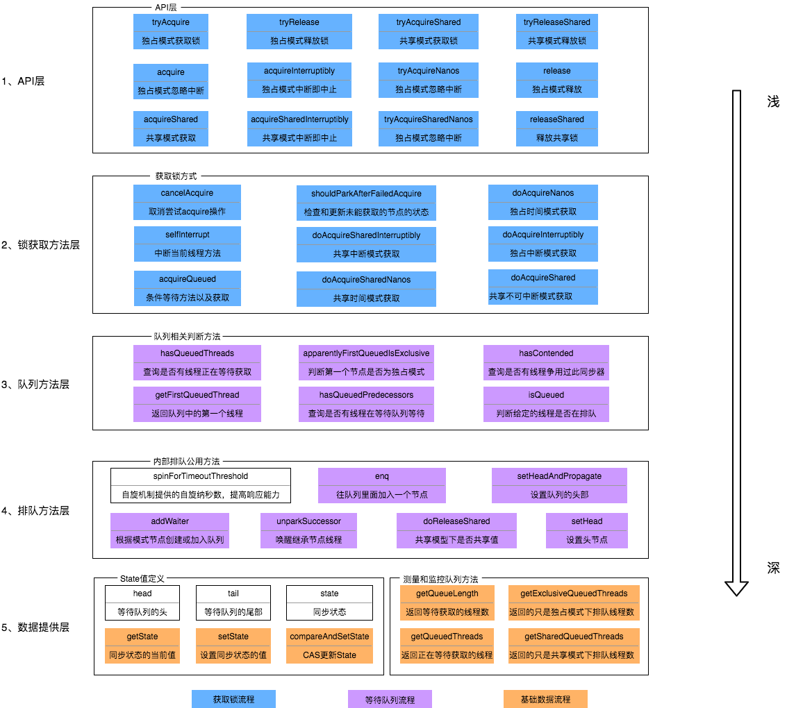

## 什么是AQS

abstract queueed synchronizer 抽象队列同步器。位于JUC下，是一个抽象类

以下都是基于AQS实现的，是一个JUC的基础类

- ReentrantLock（可重入锁）
- ReentrantReadWriteLock（读写锁）
- CountdownLatch
- Semaphore（信号量）
- Worker（ThreadPool下）

要做到通用, 那么就要开放一些方法让子类自己去覆写, 父类只管实现公用的代码

AQS的主要使⽤⽅式是继承，⼦类通过继承AQS并实现它的抽象⽅法来管理同步状态，同步器的设计基于模板⽅法模式，所以如果要实现我们⾃⼰的同步⼯具类就需要覆盖其中⼏个可重写的⽅法，如tryAcquire、tryReleaseShared等等。  


## AQS 的构成

设计这样一个基础类需要考虑的事情：

1. 要做到通用,无论子类是尝试获取锁 或是子类需要公平锁/非公平锁 都可以通过继承父类来实现，抽象出所有需要用的方法
2. 利用CAS，原子地修改竞争资源的标志位（一个资源能被几个线程使用需要一个标识）
3. 阻碍其它线程的调用，需要设计一个等待队列
    - 有的线程只是尝试一下获取对象，获取不到就算了
    - 有的线程就是想要获取到对象，获取不到它宁愿等待

实际上的实现也差不多, 我们需要一个状态量 通过CAS地修改这个状态量来表示当前竞态资源的状态;   我们需要一个排队的队列, 需要获取锁的线程来这个队列里排队 依次尝试获取锁以保证公平(非公平则直接CAS地竞争修改状态量即可)

AQS的构成如下(有颜色的为方法 无颜色的为属性)




### 同步状态state

```java
private volatile int state;
```

这个同步状态是用来标志竞争资源的. 通过CAS地修改来实现

为什么需要int 而不是boolean呢?   因为在共享模式下,可能有多个线程访问统一资源 所以status需要表示阻塞在当前资源上的线程数量

### 同步节点


一个节点里 记录了

| 方法和属性值 | 含义                                                         |
| :----------- | :----------------------------------------------------------- |
| waitStatus   | 当前节点在队列中的状态                                       |
| thread       | 表示处于该节点的线程                                         |
| prev         | 前驱指针                                                     |
| predecessor  | 返回前驱节点，没有的话抛出npe                                |
| nextWaiter   | 指向下一个处于CONDITION状态的节点（由于本篇文章不讲述Condition Queue队列，这个指针不多介绍） |
| next         | 后继指针                                                     |

一个Node里面只有三个属性: pre next status   分别表明前驱节点 后继结点  当前节点状态

status有如下状态 :

| 枚举      | 含义                                           |
| :-------- | :--------------------------------------------- |
| 0         | 当一个Node被初始化的时候的默认值               |
| CANCELLED | 为1，表示线程获取锁的请求已经取消了            |
| CONDITION | 为-2，表示节点在等待队列中，节点线程等待唤醒   |
| PROPAGATE | 为-3，当前线程处在SHARED情况下，该字段才会使用 |
| SIGNAL    | 为-1，表示线程已经准备好了，就等资源释放了     |

节点有三种共享状态: Shared Exclusive Condition, 分别通过继承Node覆写部分方法来实现


## AQS锁的获取与释放

这里只讲独占模式的.  共享模式的只有部分不同; 前面提到了, 有些业务场景下只需要尝试获取锁 没获取到宁愿等待; 有些业务场景下则必须获取到锁才能进行下一步, 所以AQS里面有tryXXX和XXX方法

前面已经说到, AQS里 对共享资源的访问是需要排队的, 所以我们先看aqs的Node队列的入队与出队的源码

### 队列的入队与出队

#### **队列入队:**

```java
private Node addWaiter(Node mode) {
    Node node = new Node(Thread.currentThread(), mode);
    // Try the fast path of enq; backup to full enq on failure
    Node pred = tail;
    if (pred != null) {  //不是空队列, 直接CAS地修改尾节点入队
        node.prev = pred;
        if (compareAndSetTail(pred, node)) {
            pred.next = node;
            return node;
        }
    }
    enq(node);   //是空队列, 尝试先将队列初始化再入队
    return node;
}
```

入队时, 先判断当前队列是否为空  若为空, 尝试完整入队: 如果队列没有初始化, 先初始化再入队

否则尝试快速入队:   CAS地将tail节点换成当前节点

#### **队列出队**

```java
    final boolean acquireQueued(final Node node, int arg) {
        boolean failed = true;
        try {
            boolean interrupted = false;
            for (;;) {  //自旋地判断 直到出队成功
                final Node p = node.predecessor();
                if (p == head && tryAcquire(arg)) { //判断当前线程的前置节点是否为头节点  当前线程是否获取锁成功
                    setHead(node);
                    p.next = null; // help GC
                    failed = false;
                    return interrupted;    //如果成功 当前线程出队, 头节点后移
                }
                if (shouldParkAfterFailedAcquire(p, node) &&   
                    parkAndCheckInterrupt())   //如果还没到当前线程  判断是否需要将其挂起以减少CPU空转
                    interrupted = true;
            }
        } finally {
            if (failed)
                cancelAcquire(node);
        }
    }
```

判断当前节点的前置节点是否为头节点(头节点是一个虚节点) 若是, 则排队到队伍头了  可以出队了

否则判断当前线程是否应该挂起以减少CPU空转

### acquire && tryAcquire

#### tryAcquire 方法

 直接抛出异常 方法为protect修饰 交给子类去覆写业务逻辑

```java
protected boolean tryAcquire(int arg) {
    throw new UnsupportedOperationException();
}
```

#### acquire方法

保证一定可以获取到锁,首先尝试获取锁, 若成功则直接跳出; 若失败则先将当前线程造一个Node排队, 再从队列中获取锁

```java
public final void acquire(int arg) {
    if (!tryAcquire(arg) &&
        acquireQueued(addWaiter(Node.EXCLUSIVE), arg))
        selfInterrupt();
}
```

### release && tryRelease

释放锁, 可以用以实现Lock.unlock() 方法  
tryRelease与tryAcquire一样 开放给调用方覆写

```java
protected boolean tryRelease(int arg) {  //开放给调用方覆写
    throw new UnsupportedOperationException();
}   

public final boolean release(int arg) {  //将后续线程唤醒, 让它们来抢锁
    if (tryRelease(arg)) {
        Node h = head;
        if (h != null && h.waitStatus != 0)
            unparkSuccessor(h);  //unpark方法 寻找当前节点的后续节点状态不为cacelled的
        return true;
    }
    return false;
}
```


## ReentrantLock
ReentrantLock基于AQS，在并发编程中可以实现公平锁与非公平锁来对资源进行同步，同时与synchronized一样，reentrantLock支持可重入。除此之外ReentrantLock在调度上更加灵活

[[ReentrantLock]]