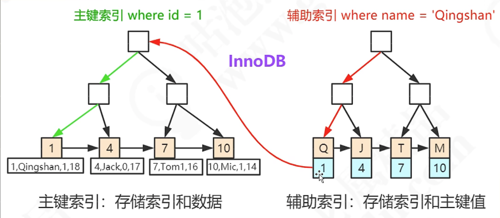

## 解释一下索引? 聚簇索引与非聚簇索引? 最左前缀原则? 回表?
这种问题全部都可以拿翻字典来类比  作一个通俗的解释
索引 --- 目录
聚簇索引 --- 拼音检索的目录
非聚簇索引  --- 部首检索的目录
最左前缀原则 --- 类似于字典序 一级索引有序的前提下 二级索引才有序
回表  --- 部首检索到了字  拿到了页码 去翻相应页的过程

本来没有计算机没有数据库的时候, 人类检索知识还得去图书馆, 所以检索学是早于数据库诞生的, 两者的设计思路上都是一脉相承的  这样举例也是合理的

> 索引锁的是什么？锁在字段上 还是行上？

其实是锁在聚集索引上,在innoDB_LOCKS表中 有一个字段专门显示lock_inex

值得注意的是 如果该表没有显式的建立主键索引 或者唯一索引，那么默认用row_id 来充当聚集索引  这个时候就会“锁表”

聚集索引可能是

1. 主键索引 primary key
2. 唯一索引 unique key not NULL
3. row_id 一个隐藏字段   每张表都必然有三个隐藏字段  row_id tx_id roll_ptr （MVCC）

聚集索引决定数据存放的顺序，一张表必然有聚集索引！

非聚集索引（英文 secondary Index 直译为二级索引）

类似于中文字典  可以用拼音查 也可以用部首查，但它的数据存储顺序是按照拼音的顺序（字典序）来的

二级索引查找到主键索引后 通过主键索引去查数据（回表）

 

> InnoDB是怎样解决幻读问题的？
