跟随清华大学操作系统教程(链接: [清华 操作系统原理_哔哩哔哩_bilibili](https://www.bilibili.com/video/BV1uW411f72n?spm_id_from=333.788.top_right_bar_window_default_collection.content.click))做的一些笔记,  配套用书是《现代操作系统》 （机械工业出版社 黑皮书系列）

主要看了

- 内存管理
- 进程调度
- IPC问题与死锁

三大板块

<!--more-->

## 虚拟内存之前—–连续内存分配

内存碎片问题: 外部碎片与内部碎片  都应尽量减少

外(内)部碎片: 分配单元间(内)没有使用的碎片

**首次适配策略 First Fit**

遍历空闲地址块, 只要满足适配就分配

**最适合适配  Best Fit**

匹配最小的适配空间(贪心策略)

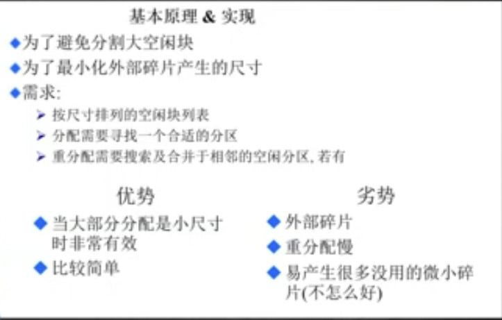

**最差匹配分配 Worst Fit**

匹配最大可用的空闲块

需求是随机的,以上三个简单的管理算法无法满足需求

**压缩式内存管理(紧致)**

1.内存拷贝的开销

2.程序运行中不能进行内存地址的挪动

**交换式内存管理 swapping**

将等待的内存换出内存换入磁盘 空出的内存空间

### 非连续的内存管理

**为什么需要非连续的内存管理?**

连续的内存管理导致内存没有充分得到利用, 碎片较多。  可以参考

#### 分段

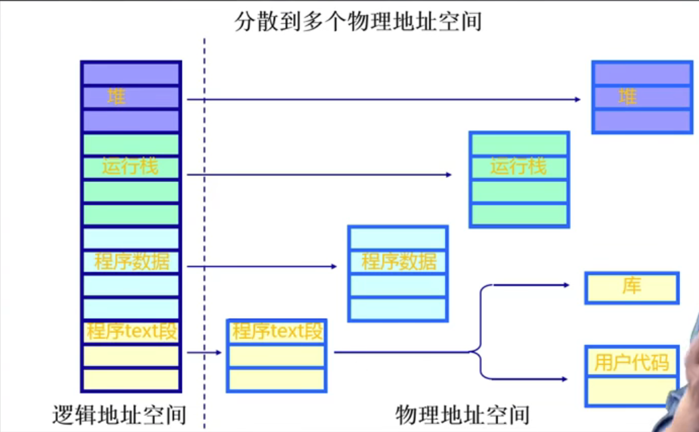

左边是连续的逻辑地址空间

但其实映射到了不同的物理地址空间

软件实现开销较大

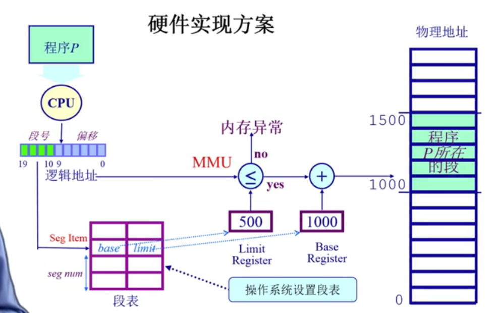

段表Segemnt Table,存放两个信息

1. 段号与实际地址的映射关系
2. 段的大小

#### 分页

与分段不同的是 页的大小是固定的

逻辑页(page)大小 == 物理页(frame)大小

- 页表
- MMU & TLB

**物理页帧Frame**

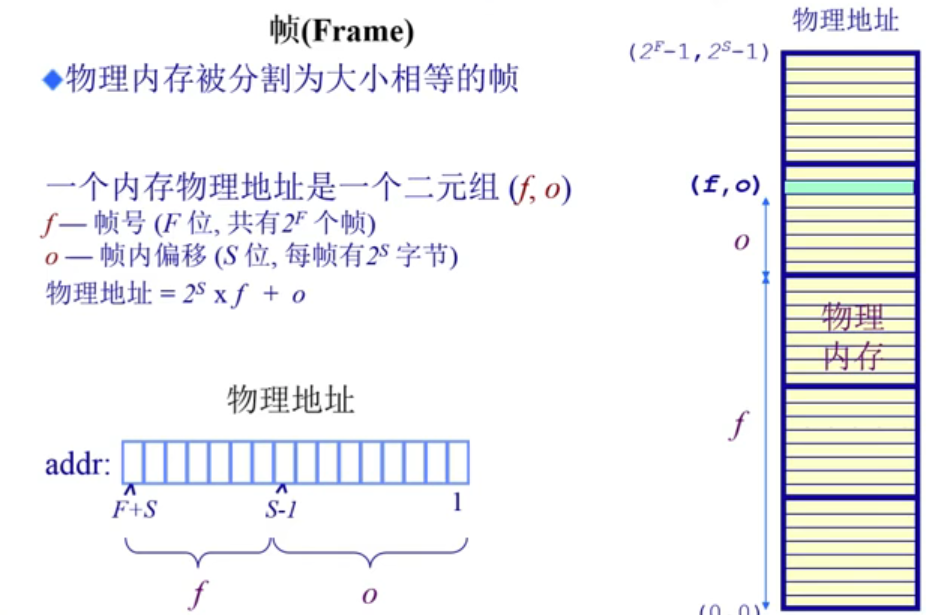

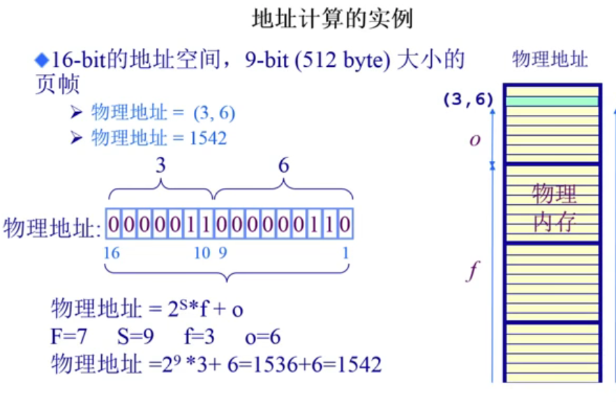

页帧的大小为9bit,则一页有2^9 = 512 个Byte

页帧号为3  3*512  偏移量为6  再+6

逻辑页,与物理帧的大小是相等的,大致如下

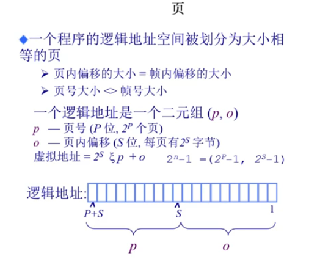

**页寻址机制**

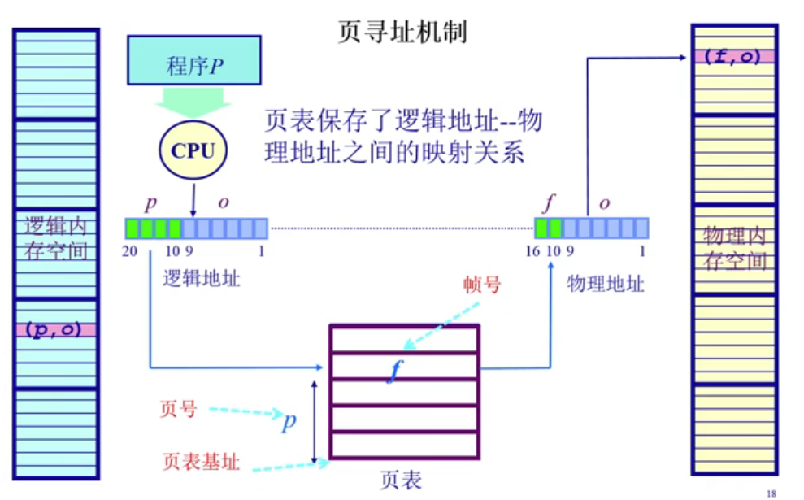

页表维护了一个页号到帧号的映射

由操作系统 在操作系统初始化(enable)时候建立

存在的问题:

1. 逻辑地址可能非常多,页表可能非常大
2. 随之而来的,页表如果很大 就不能放入cache而必须放入内存, 就需要访问两次内存(获取页表项&&访问数据)

如何处理?

1. 缓存
2. 多级页表(时间换空间)

**TLB(快表 Translation Look-asside Buffer)**

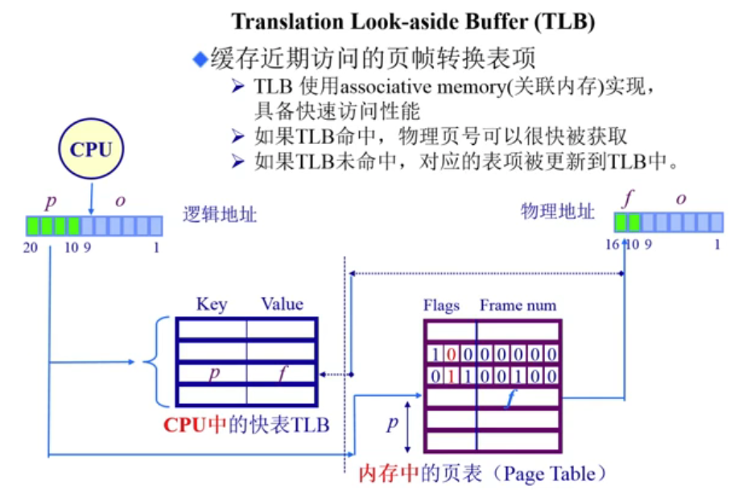

访问局部,TLB就不容易MISS

**二级页表,多级页表**

先去通过p1查询一级页表,一级页表中存放二级页表(可能有多个)的起始位置

查找到了二级页表的起始位置 加上p2 得到二级页表的表项

二级页表的表项对应物理帧的位置

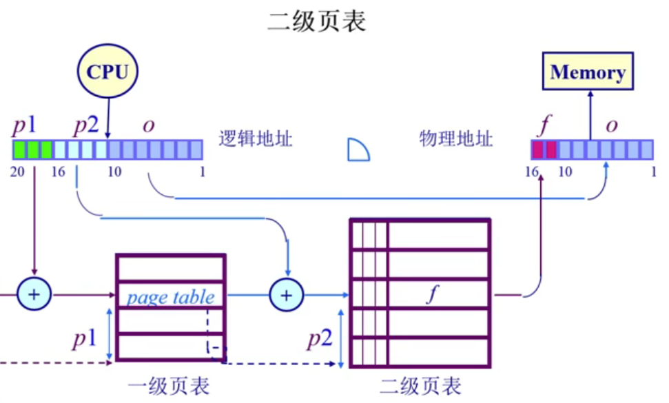

多级页表(一颗页表树)

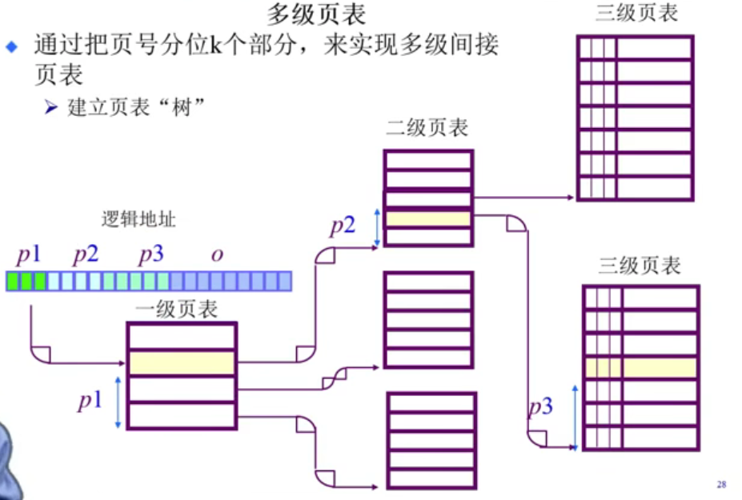

采用多级页表的好处:

虽然多了一次查询的过程,但是部分虚拟页与物理帧不匹配的表项(Risidence = 0)  不用再存储在内存中,所以节省了内存空间

#### 反向页表

## 虚拟内存

解决内存容量不够的问题，使得程序员有更大更快更好用，非易失的存储器

折中的方法：  存储器层次结构

但是比较麻烦，考虑用操作系统来管理  把常用的程序放进有限的内存

### 虚拟内存之前的两个技术

#### 覆盖技术（程序员手动）

**核心：不存在调用关系的模块 可以共用同一块内存**

比如8、90年代，DOS系统 需要操作系统与编程语言的支持（如pscal）

缺点：

1. 设计开销，变成麻烦
2. 时间开销，外存装入内存费时

#### 交换技术（操作系统自动）

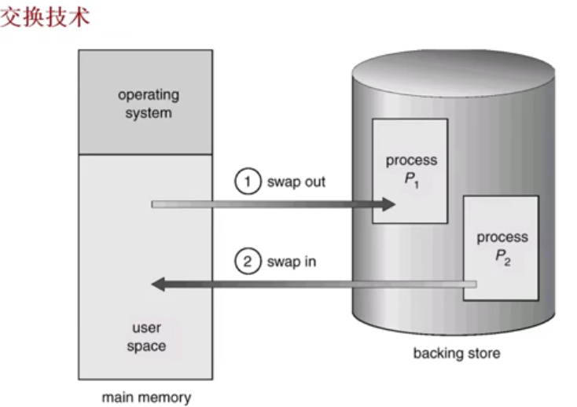

几个问题：

1. 什么时候换入换出  太频繁的话反而影响与性能，在内存不够时才换出
2. 如何重定位的问题（动态地址映射页表）
3. 交换区的大小过大  整个程序导入导出开销过大

#### 虚存技术

**程序局部性原理表明： 一个程序经常访问的指令与内存空间应该是比较密集的，因此不需要将整个程序一次性load在内存中，而可以采取先load一部分的策略**，这样就可以在有限的内存里运行更多的程序。

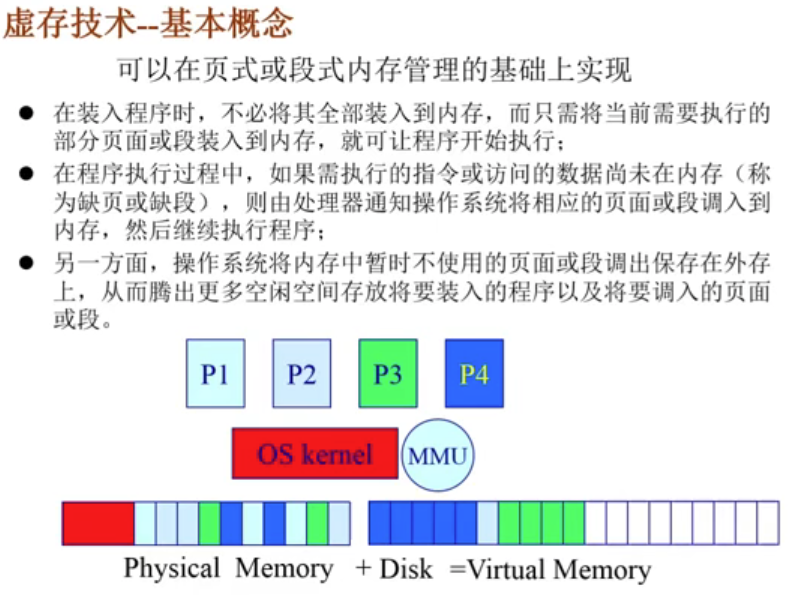

页表表项中几个常用的位：

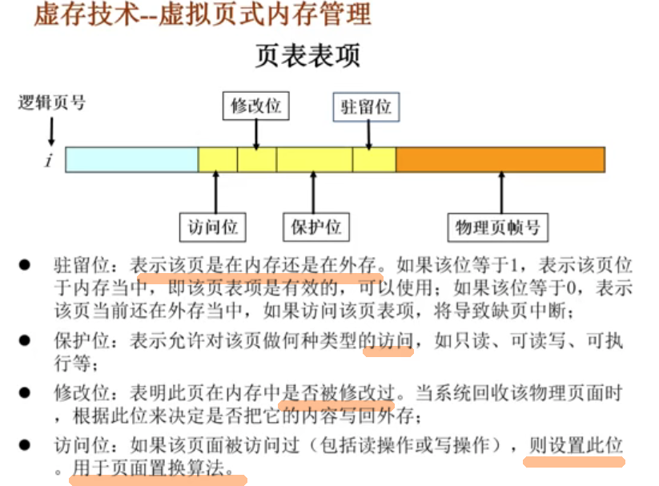

驻留位：该逻辑页是否在内存中有对应

保护位：限制访问（内存中有些地址是需要保护不可以被访问的）

修改位：该页在内存中是否被修改，如果没有被修改，则在换出到硬盘时不需要进行写操作（内容没有变）

访问位：标记该页是否被访问过，用于设计页面置换算法

**缺页中断处理**

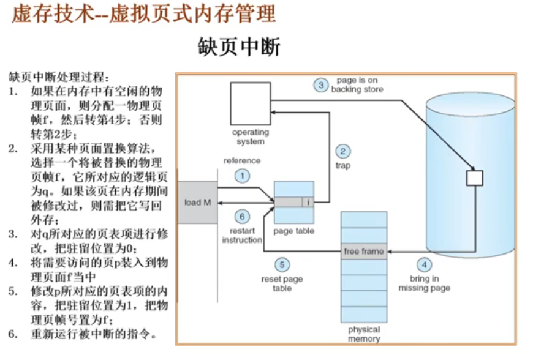

是否有物理页面->若有，直接分配/若无,页面置换算法换下一个->换下的页面写入硬盘->释放的物理页空间用于存放虚拟页相应内容->修改页表项,重新进行映射

### 页面置换算法

理想情况下：当缺页中断产生时，选择将来很长一段时间内不会访问到的页，将其换出

#### **先进先出FIFO算法：**

选择在内存中驻留时间最长的页面并淘汰，用一个队列维护即可

实现简单，但是产生的缺页中断次数较多

会有Belady现象：

#### **LRU Least Recent Used 最久未被使用算法**

其依据是程序局部性原理，通过历史推断未来

维护开销比较大，可以用链表实现： 每次使用某一页面的时候，在链表中查找并将其放在链表头，每次需要换出页面时，从链表尾部删除

每次使用页面都要遍历链表进行查找，开销很大

#### **Clock页面置换算法**

LRU的近似，但是开销更小，只用了一个bit。页表中有一位是used bit（access bit），每次访问到会通过硬件置1（也可以由软件置0）

操作系统将所有页维护成一个环形链表，定期将页通过软件全部置0

如果置0后又有某一页被硬件置1，则说明近期使用过该界面

轮询这个链表。

每次换出的是used bit为0的界面

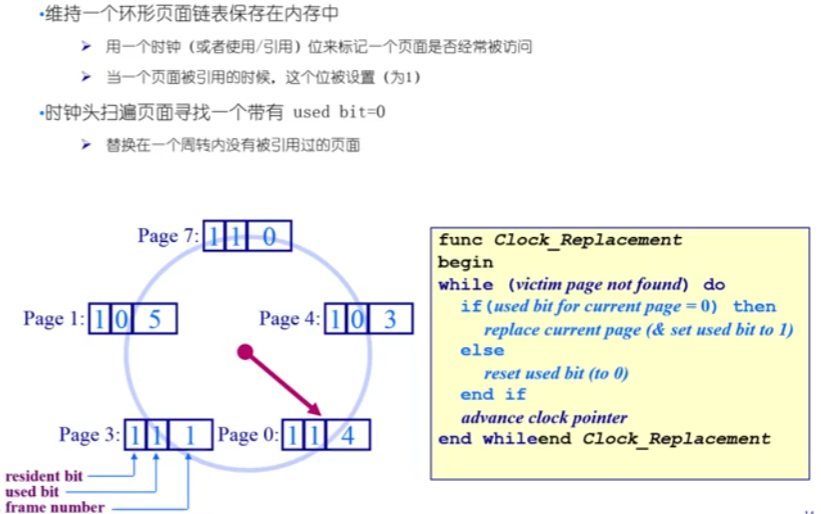

效果贴近LRU算法， 

#### **Enhance Clock算法（Clock算法的改进），即二次机会法**

Clock算法效果不错，但是磁盘IO比较大，如果在判断是否换出时考虑dirty bit是否为1则可以有效减少磁盘的IO次数：

**如果使用位access bit为1 表示最近使用过**

**如果脏位dirtybit 为1  表示此页面在内存中被修改过，需要重新写入磁盘**

我们想要置换出内存的页： 最近没有使用过，而且最好是也没有修改过（这样就不用等磁盘IO）

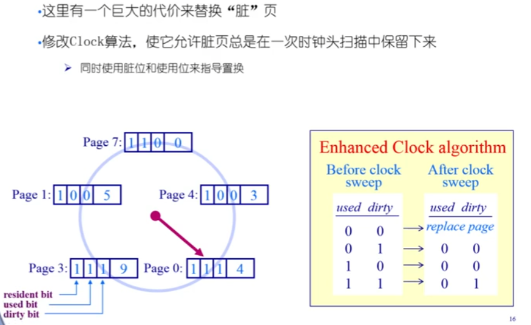

## 进程管理

程序是一个**静态**的代码 进程是一个**动态**的程序执行过程

一个程序可能包含多个进程；一个进程里可能会执行多个程序  是一个**多对多**的关系

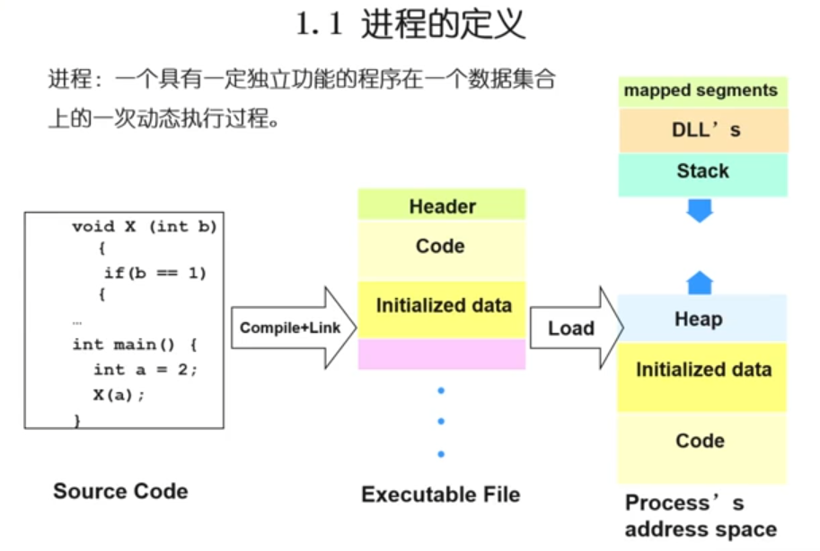

> 并发与并行：

关键看有没有**争抢**，并发是需要争抢资源的 比如双十一高并发抢货，并行是彼此不受干扰的 比如并口通信

> 用户态与内核态：

关键看是不是能访问整个内存，用户态下部分内存是被保护的 无法访问，内核态则开放所有内存。

简而言之,进程运行在用户空间时  处于用户态;  运行在内核空间时  处于内核态. 

区分用户态与内核态的目的是提高操作系统的稳定性,只将低危险度的指令交给用户,高危险的指令需要申请才能使用,以降低系统崩溃的可能性.

**用户态与内核态的切换:**

1. 系统调用：  用户需要操作文件系统、内存管理、进程调度等操作系统接手了的工作时，需要向操作系统申请

2. 异常：  如缺页异常，操作系统会自动接手把所需要的页面置换进内存

3. 硬件中断： 外设发硬件中断时操作系统也会接手

除了系统调用是用户主动申请切换到内核态，其它两种情况（异常、硬件中断）都是发生了意外操作系统主动介入。

进程的特点：

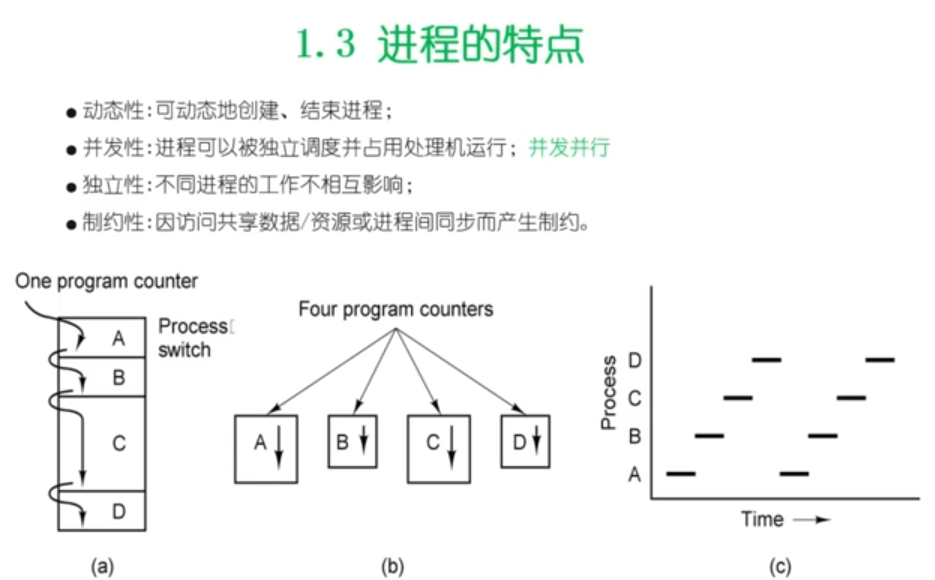

进程控制块 （Process Control Block） PCB 是唯一标识进程的数据结构

每个进程控制块如图所示，它包含许多与当前进程相关的信息：

- **进程状态**：状态可以包括新的、就绪、运行、等待、停止等。
- **程序计数器**：计数器表示进程将要执行的下个指令的地址。
- **CPU 寄存器**：根据计算机体系结构的不同，寄存器的类型和数量也会不同。它们包括累加器、索引寄存器、堆栈指针、通用寄存器和其他条件码信息寄存器。在发生中断时，这些状态信息与程序计数器一起需要保存，以便进程以后能正确地继续执行。
- **内存管理信息**：根据操作系统使用的内存系统，这类信息可以包括基地址和界限寄存器的值、页表或段表。
- **I/O 状态信息**：这类信息包括分配给进程的 I/O 设备列表、打开文件列表等。
- **CPU 调度信息**：这类信息包括进程优先级、调度队列的指针和其他调度参数。
- **记账信息**：这类信息包括 CPU 时间、实际使用时间、时间期限、记账数据、作业或进程数量等。(用于判断进程是CPU密集型还是IO密集型)

进程的三种状态

考虑进程的创建与结束态： 

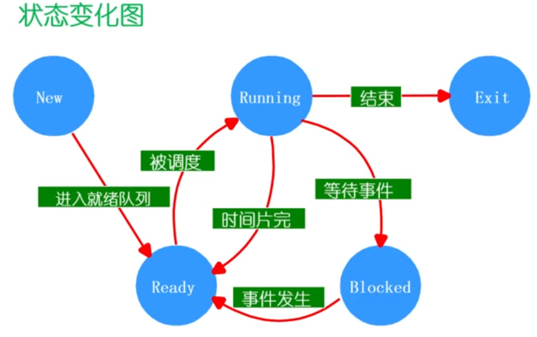

挂起：进程没有占用内存空间，整个被换出到磁盘上。

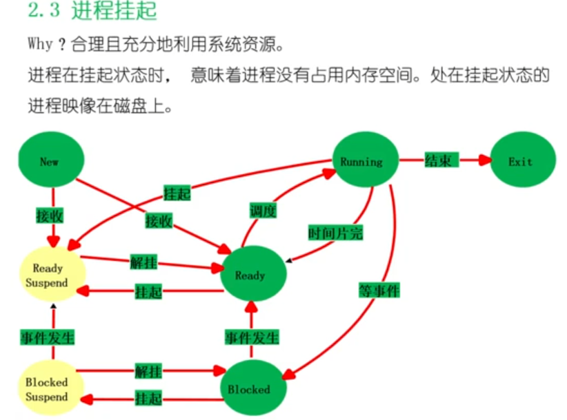

挂起是为了解决内存不足，把内存腾出来给别的进程用。

分为阻塞挂起、就绪挂起、运行到就绪挂起

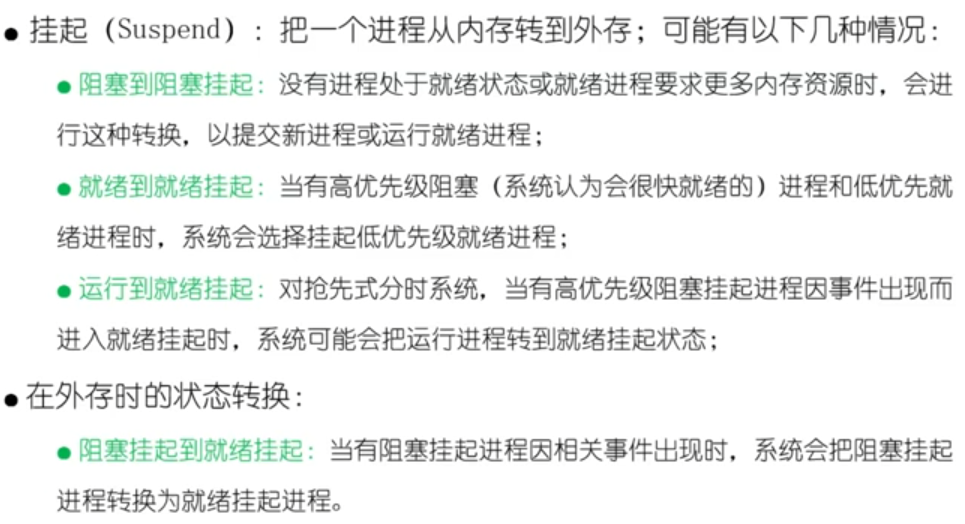

线程

> 为什么用线程：

1. 为了更小粒度的进行CPU资源的调配

2. 为了避免进程间通信的开销

线程 = 进程 + 共享资源

缺点： 一个线程崩溃可能会导致其它线程的崩溃（共享上下文）

> 进程（Process）VS 线程 (Thread)

1. 进程是资源分配的最小单位，线程是CPU调度的最小单位
2. 进程的资源的是全套的，线程只独享必须的资源（如寄存器与栈）
3. 线程的并发执行开销更小
   - 线程的创建开销小（进程需要申请内存、CPU调度等 但线程可以直接复用创建线程的进程的资源）
   - 线程切换时间短
   - 线程共享上下文 不用通过内核进行通信

### 进程的控制与上下文切换

### 通用调度算法

#### 调度算法衡量指标

CPU利用率, 越高越好

吞吐量,   单位时间内完成的进程数量,越高越好

周转时间, 进程的整个生命周期 从初始化到结束所花费的时间,越短越好

等待时间, 进程处在就绪队列中的总时间

响应时间, 进程从请求到响应的时间 越短越好

公平性, 每个进程应该尽可能公平地得到CPU的资源

不同的操作系统着眼点不一样

比如交互式的系统,想要的是短任务可以及时响应 如windows上双击鼠标, 此时响应时间是主要考虑的

比如批处理式的系统, 想要的是能在单位时间内完成尽可能多的任务, 吞吐量是主要考虑的

比如多用户的系统, 想要的是每个用户得到的计算资源尽可能均匀, 公平性是主要考虑的

#### FCFS First Come First Served 先来先服务

优点

- 实现简单

缺点

- 不够公平,且平均等待时间长
- IO密集型的任务 会导致CPU闲置

#### SPN  short Process Next 短进程优先

优点

- 最短平均等待时间

缺点

- 短任务流会导致长任务饥饿(有违公平性)
- 需要知道进程的执行时间,一般来说做不到,除非是**实时操作系统**;有公式可以根据历史情况去预估执行时间

#### **操作系统的分类：**

**分时操作系统**：如Unix系统，一个操作系统服务多个用户，时间片轮转。

**实时操作系统**:工业中常用的操作系统，有什么流程已经写死了

**批处理操作系统**：典型的如早期的操作系统，比如穿孔卡片时代统计美国用来做人口普查的机器，程序写好了 一批数据喂进去 人在旁边等结果出来。现在一般用于科研领域，超算是其中一类

#### Round Robin 时间片轮转

就是分时复用,主要需要考虑的是时间片的划分

**时间片划分得太小,导致进程切换过于频繁,开销过大**

**时间片划分得太大,则退化成FCFS先来先服务算法**

一般的经验是,将进程切换花销的时间控制在整个进程生命周期的1%以内

实际上， 如Java等语言， 都是基于线程优先级来进行抢占式调度的；

#### Multilevel Feedback Queues 多级反馈队列

强调动态分配进程的优先级

时间片随优先级增加而增加

如果在当前时间片没有完成任务  则下调优先级

如此一来:

- CPU密集型任务优先级下调得快

- IO密集型任务停留在高优先级

> **优先级反转现象**

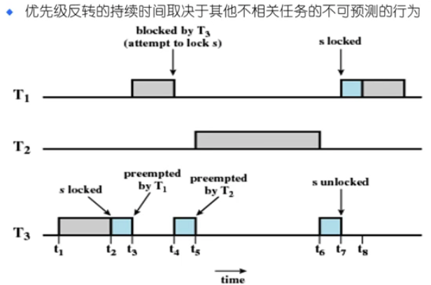

假设有三个Task  T1 T2 T3  优先级上T1>T2>T3

t1~t2 T3正常执行 t2~t3 T3访问共享资源并上锁

t3时刻 T1就绪,由于高优先级,T1立即执行,直到t4时刻T1需要访问共享资源,此时共享资源被T3锁住了,T1进入等待

t3继续访问共享资源,执行  直到t5时刻

t5时刻  T2就绪,由于其优先级高于T3,T2立即执行  直到T2执行完毕,控制权转交T3,T3完成对共享资源的访问,T1才能继续执行

**此时发生了一个现象:高优先级任务通过信号量机制访问共享资源时，该资源被一低优先级任务占有，因此造成高优先级任务被许多具有较低优先级任务阻塞，实时性难以得到保证。**

解决方法:

**优先级继承**

1. 将资源也赋一个优先级, 其优先级与“锁定此资源的任务”的“最高优先级”相同

2. 除非有优先级高于资源优先级的任务,否则尝试访问锁定资源的任务将会被阻塞

**优先级天花板**

申请共享资源的任务的优先级 提高到可能访问该资源的所有任务中的最高

### 一些概念

临界区: 访问共用资源的程序片段

互斥: 当一个进程处于临界区且访问共享资源时,不允许其它进程访问该共享资源

死锁: 两个或以上的进程,都在等待对方释放资源以完成任务,而导致任务都执行不下去.

饥饿: 可执行的进程被调度器持续忽略,明明可执行却不被执行

### IPC问题  进程间通信问题

假设进程P与进程Q要通信,怎么办?

以是否直接通信划分 有两种办法:

1.双方由kernel作为中间人来通信(间接通信)

2.双方进程直接通信(直接通信)

#### 1.管道pipe

其实就是内核中的一个buffer,信息单向流动 一端输入一端输出  比如Shell中`%ls | more`

要求必须建立在父子进程中，即两个进程必须要有亲缘关系。

#### 2.消息队列message queue

管道中的数据是字节流, 而消息队列中的数据是结构化的,底层是用链表实现的

#### 3.信号signal

在软件层面实现的中断, 一种异步打断的机制:  发出一个信号,接收到信号的进程完成相应的操作(Catch然后执行相应方法,或者ignore掉),处理完后回到程序继续运行

比如Shell里正在跑程序 你想中断它  直接按下Ctrl+C，想暂停按下Ctrl+Z

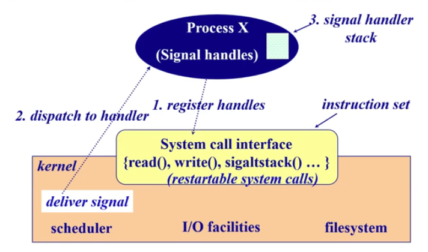

#### 4.信号量

Dijkstra大神提出的，一种用于解决进程间访问资源的通讯方式。  我们可以将其理解成一个具有原子性的计数器，每当有进程申请使用信号量，通过一个`P操作`来对信号量进行`-1`操作，当计数器减到`0`的时候就说明没有资源了，其他进程继续访问就会被阻塞，当该进程执行完这段工作释放临界资源之后，就会执行`V操作`来对信号量进行`+1`操作，被阻塞的进程就会被唤醒。

#### 5.共享内存share memory(直接通信)

维护一个共享的内存区域,使得所有进程可见   

- 优点:快速方便(不用数据复制)  
- 不足:需要考虑同步互斥的问题

极端情况下，也可以共享文件（不推荐）

#### 6.Socket套接字

IP：端口号  形成一个套接字来通讯，属于网络编程的范畴了  比如redis里面主从同步互相ping

### 死锁

死锁的四个必要不充分条件,即死锁了会出现以下情况,但以下情况出现了并不一定会死锁

即**资源互斥\持有等待\循环依赖\无抢占**

资源互斥：资源同时只允许一个进程访问

持有等待：所有进程都持有一个资源，同时又在等待其它进程释放资源

循环依赖：依赖形成一个环

无抢占：资源必须由进程主动释放

死锁的规范定义如下：

**如果一个进程集合中的进程 都在等待集合中的其它进程释放资源 才能继续执行，那么该进程集合就是死锁的**

#### 死锁的处理办法

从介入事件来分

**死锁预防->死锁避免->死锁检测->死锁恢复**

操作系统也可以不处理死锁(**鸵鸟算法**)  因为检测死锁并处理是一个非常耗资源的事情

##### 死锁的预防

既然死锁了会出现上述的四个情况,那么破坏这四种情况就可以打破死锁

1. **破坏互斥** … 比较不合理，**对共享资源的访问本来就应该互斥**

2. **破坏持有等待**  要么都占有,要么都不占有   **可行,但是可能会出现饥饿的情况.** 以哲学家就餐为例,拿起左叉发现右叉被占有了, 此时应该把左叉也放下   但这样可能会出现饥饿的情况,因为资源总是不够的,有些进程会一直得不到资源

3. **破坏循环等待**  比较可行,实际上部分嵌入式系统用的就是这种处理方式,将资源分级,每次只能申请更高/更低等级的资源  这样就不会形成环了  但是其它**OS中资源类型过于丰富,实现起来不现实**

4. **破坏抢占**  比较暴力,进程需要这个资源才能继续运行  那只能**把这个进程kill掉 不大合理,问题是解决了 进程也被解决了**

##### 死锁避免（银行家算法）

银行家算法的实质就是要设法保证系统动态分配资源后不会进入不安全状态，以避免可能产生的死锁。 即每当进程提出资源请求后当系统的资源能够满足该请求时，系统将判断满足此次资源请求后系统状态是否安全，如果判断结果为安全，则给该进程分配资源，否则不分配资源，申请资源的进程将阻塞。

##### 死锁检测（wait for graph）

事先分配资源的时候, 看看会不会出现循环等待的情况

这种处理方法的典型如MySQL  维护一个wait_for Graph来描述等待关系,每次分配资源的时候DFS这张图,看这个资源分配下去是否会出现环  若出现环则不分配

Mysql里用的就是死锁检测的算法。

##### 死锁解除

该算法可将系统从死锁中解脱出来。

- 资源剥夺法：将一些死锁进程暂时挂起来，并且抢占它的资源，并将这些资源分配给其他的死锁进程 ，要注意的是应该防止被挂起的进程长时间得不到资源而处于饥饿状态。
- 撤销进程法：强制撤销部分甚至全部死锁并剥夺这些进程的资源。撤销的原则可以按照进程优先级和撤销进程的代价高低进行。
- 进程回退法：让一或多个进程回退到足以回避死锁的地步，进程回退时自愿释放资源而非被剥夺。这个方法要求系统保持进程的历史信息，并设置还原点。
