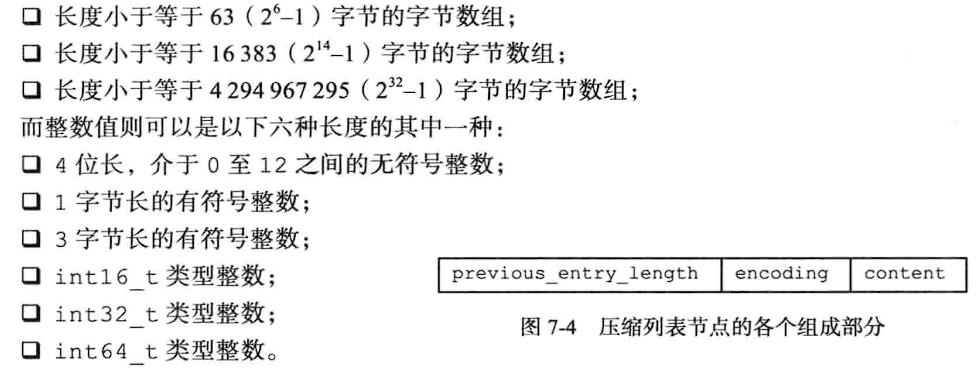

## 引入

Redis设计了一套对象系统, 共有五大对象 string hash list set sortedSet 
根据场景的不同 每种对象在不同的情况下 会采取不同的编码格式. 不同的编码格式与不同的底层数据结构一一对应
所以  
对象类型 => 编码方式  1:N
编码方式 => 数据结构 1:1

我们可以通过`object encoding KEY`命令来获取对应key的编码方式
通过 `type KEY`命令来获取对应key的对象类型
### Redis的数据结构与编码方式


他们之间的对应关系可以查看这张图


接下来. 逐一介绍每种对象和它在不同条件下的编码方式(底层数据结构)

## 字符串对象及其编码
### intro

源码: [redis/sds.h at unstable · redis/redis (github.com)](https://github.com/redis/redis/blob/unstable/src/sds.h)

对于字符串类型, 可以用 set key value来进行设置, value就为字符串的字面量
```
127.0.0.1:6379> set sayHi "Hello World!"
OK
127.0.0.1:6379> get sayHi
"Hello World!"
```

特别地 ,当这个value为一个数字时 需要分情况讨论

1. 如果小于LONG_MAX的范围，可以用int来存储
2. 如果为浮点或数字太大， 可以用raw（即SDS）或embstr（SDS的对象形式）进行存储
```
127.0.0.1:6379> set BIGVALUE 99999999999999999999999999999999999999999999999999999999999999
OK
127.0.0.1:6379> get BIGVALUE
"99999999999999999999999999999999999999999999999999999999999999"
127.0.0.1:6379> OBJECT encoding BIGVALUE
"raw"
# 可以看到 如果一个数字的值非常大 它的存储是用raw(SDS)来存储的
127.0.0.1:6379> set smallValue 12341234
OK
127.0.0.1:6379> get smallValue
"12341234"
127.0.0.1:6379> OBJECT encoding smallValue
"int"
# 如果数字不大  则可以通过int来存储
```

### REDIS_ENCODING_RAW 简单动态字符串SDS
```cpp
struct sdshdr{
    int len;   //记录string长度
    int free;  //记录没有分配的空间
    char buf[];   //二进制安全的buf数组
}
```

这样设计的好处 

1. O(1)获取String的长度

2. 二进制安全,虽然是string 但是图片等信息也可以存

3. **避免频繁地进行内存重分配**

4. **内存预分配,惰性空间释放**


**内存预分配**:先分配够用的,不够再扩容,类似于vector
其策略:

1. SDS有效长度( 即buf数组的长度)小于1M, 则预分配等同于当前buf数组长度的空间 free == len
2. 如果超过1M   则预分配1M的空间  free = len + 1M

**避免重分配**:当有预留空间没有使用时,优先使用预留的空间 而不用重新申请空间,  redis的场景中对存取速度要求严格的 string可能频繁改动, 如果内存重分配的次数过多会造成性能的下降.

**惰性空间释放**: 在空间不足时,可以惰性地释放free记录的空间, 所以不用担心预分配带来的存储压力

### REDIS_ENCODING_INT
复用C语言里的LONG  

## 哈希对象及其编码
### intro
数据量小用[[#REDIS_ENCODING_ZIPLIST 压缩列表]]实现，数据量大转[[#REDIS_ENCODING_HT 哈希表]]

具体来说，默认（可以修改）当

- K，V的长度都小于64字节

- 键值对的数量小于512时

使用zipList来省空间，否则转Hashtable

### REDIS_ENCODING_ZIPLIST 压缩列表

源码: [redis/ziplist.h at unstable · redis/redis (github.com)](https://github.com/redis/redis/blob/unstable/src/ziplist.h)


一个压缩列表ZipList , 头部记录了 整个列表的字节数 列表中的节点个数 尾哨兵位置

中间由X个列表节点Entry构成,   而每个entry节点包括



previous_entry_len 记录上一个节点的长度，用于从后往前遍历； encoding记录当前节点的长度与数据类型；content记录数据内容,是一个字节数组或整数。

#### 如何遍历压缩列表

我们可以看出: 对于压缩列表, 并没有指针, 且每个元素长度不固定 无法像数组那样通过偏移量随机寻址

其正向遍历是通过encoding确定每个entry的长度 来进行跳转的

反向遍历是通过preious_entry_length这个字段存储的前一元素长度 来进行反向跳转的

### REDIS_ENCODING_HT 哈希表

源码 哈希表实现[redis/dict.c at unstable · redis/redis (github.com)](https://github.com/redis/redis/blob/unstable/src/dict.c)

```cpp
typedef struct dictht{
    dicEntry **table;   //hash数组  每个entry都是一个hash槽

    unsigned long size;  //hash表大小

    unsigned long sizemask; //掩码

    unsigned long used;   //节点数量
}

typedef struct dict{
    dictType *type; //为了实现多态字典   记录一簇操作特定类型的键值对函数

    void *privateData; //为了实现多态字典  函数的可选参数

    dictht ht[2];  //两个hashtable  为了rehash

    int rehashIndex;  //记录rehash进行到哪里了  

}
```


拉链法解决hash冲突

**渐进式rehash**

hash表进行2的幂次扩容,hash表可能非常大,一次性扩容可能导致服务停止一段时间。 

所以使用渐进式rehash，每次取ht[0]中 rehashIndex指向的hash槽的元素进行rehash，添加到ht[1]中。然后rehashIndex++，进行下一个槽位的操作。

查找时先查找ht[0]再查找ht[1]，  新的插入直接插入ht[1]


## 列表(List)对象及其编码

### intro

当满足以下条件时使用[[#REDIS_ENCODING_ZIPLIST 压缩列表]]编码

1. 当列表对象的所有元素大小都小于64 Byte

2. 当元素个数小于512

否则使用LinedList


### REDIS_ENCODING_LINKEDLIST 双端带头链表

```cpp
//链表节点
typedef struct listNode{
    struct listNode *pre;
    struct listNode *next;
    void *val
}

typedef struct list{
    //头 尾  长度
    listNode *head;
    listNode *tail;
    unsigned long len;
    //节点复制函数
    void *(*dup) (void *ptr);
    //节点释放函数
    void *(*free) (void *ptr);
    //节点对比函数
    void *(*match) (void *ptr);
}
```

## 集合(Set)对象及其编码

### intro

元素数量<512 && 元素都是整数值 使用 [[#REDIS_ENCODING_INTSET 整数集合]]

否则用[[#REDIS_ENCODING_HT 哈希表]]

### REDIS_ENCODING_INTSET 整数集合

[redis/intset.h at unstable · redis/redis (github.com)](https://github.com/redis/redis/blob/unstable/src/intset.h)

其实现复用了zipedList的底层数据结构, 只是这个list一直被intSet维护着有序的状态(很简单, sort即可)

这样就可以用二分查找去查询元素了


## 有序集合(ZSET)对象及其编码
### intro
当 元素数量<128 && 每个元素成员长度 < 64Byte 使用[[#REDIS_ENCODING_ZIPLIST 压缩列表]]
否则使用 [[#REDIS_ENCODING_SKIPLIST 跳表]]

### REDIS_ENCODING_SKIPLIST 跳表


跳表是一种有序的数据结构，支持平均O(logN) ,最坏 O(N)的查找， 效率可以与平衡树媲美，但是实现更简单，在区间遍历上比红黑树优秀。

跳表的实现有点类似于**多层索引**，底层有序 逐层简历索引。

如果redis中的有序集合（zset）的成员较多，且为较长的字符串时，就会用跳表来实现。

层高是一个[1,32]之间的随机数。

具体介绍可以参考： [Skip List--跳表（全网最详细的跳表文章没有之一） - 简书 (jianshu.com)](https://www.jianshu.com/p/9d8296562806)

[[../redis为什么使用跳表而不是红黑树]]


## 总结编码类型与底层实现

### String对象的存储
[[#REDIS_ENCODING_RAW 简单动态字符串SDS]] (字符串或大于LONG_MAX的数字)
[[#REDIS_ENCODING_INT]]

### Hash对象的存储

数据量小用[[#REDIS_ENCODING_ZIPLIST 压缩列表]]实现，数据量大转[[#REDIS_ENCODING_HT 哈希表]]

具体来说，默认（可以修改）当

- K，V的长度都小于64字节

- 键值对的数量小于512时

使用zipList来省空间，否则转Hashtable

### List对象的存储

当满足以下条件时使用[[#REDIS_ENCODING_ZIPLIST 压缩列表]]编码

1. 当列表对象的所有元素大小都小于64 Byte

2. 当元素个数小于512

否则使用[[#REDIS_ENCODING_LINKEDLIST 双端带头链表]]

### Set对象的存储

元素数量<512 && 元素都是整数值 使用 [[#REDIS_ENCODING_INTSET 整数集合]]

否则用[[#REDIS_ENCODING_HT 哈希表]]

### zSet对象的存储

当 元素数量<128 && 每个元素成员长度 < 64Byte 使用[[#REDIS_ENCODING_ZIPLIST 压缩列表]]
否则使用 [[#REDIS_ENCODING_SKIPLIST 跳表]]