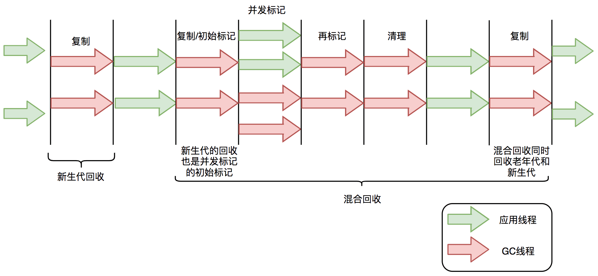
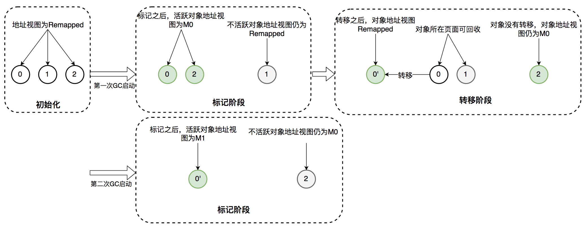

## ZGC概述

> ZGC（The Z Garbage Collector）是JDK 11中推出的一款低延迟垃圾回收器，它的设计目标包括：

- 停顿时间不超过10ms；
- 停顿时间不会随着堆的大小，或者活跃对象的大小而增加（对程序吞吐量影响小于15%）；
- 支持8MB~4TB级别的堆（未来支持16TB）。

## GC之痛

> 很多低延迟高可用Java服务的系统可用性经常受GC停顿的困扰。GC停顿指垃圾回收期间STW（Stop The World），当STW时，所有应用线程停止活动，等待GC停顿结束。

以美团风控服务为例，部分上游业务要求风控服务65ms内返回结果，并且可用性要达到99.99%。但因为GC停顿，我们未能达到上述可用性目标。当时使用的是CMS垃圾回收器，单次Young GC 40ms，一分钟10次，接口平均响应时间30ms。通过计算可知，有（40ms + 30ms) * 10次 / 60000ms = 1.12%的请求的响应时间会增加0 ~ 40ms不等，其中30ms * 10次 / 60000ms = 0.5%的请求响应时间会增加40ms。可见，GC停顿对响应时间的影响较大。为了降低GC停顿对系统可用性的影响，我们从降低单次GC时间和降低GC频率两个角度出发进行了调优，还测试过G1垃圾回收器，但这三项措施均未能降低GC对服务可用性的影响。

### [#](#cms与g1停顿时间瓶颈) CMS与G1停顿时间瓶颈

> 在介绍ZGC之前，首先回顾一下CMS和G1的GC过程以及停顿时间的瓶颈。CMS新生代的Young GC、G1和ZGC都基于标记-复制算法，但算法具体实现的不同就导致了巨大的性能差异。

标记-复制算法应用在CMS新生代（ParNew是CMS默认的新生代垃圾回收器）和G1垃圾回收器中。标记-复制算法可以分为三个阶段：

- **标记阶段**，即从GC Roots集合开始，标记活跃对象；
- **转移阶段**，即把活跃对象复制到新的内存地址上；
- **重定位阶段**，因为转移导致对象的地址发生了变化，在重定位阶段，所有指向对象旧地址的指针都要调整到对象新的地址上。

下面以G1为例，通过G1中标记-复制算法过程（G1的Young GC和Mixed GC均采用该算法），分析G1停顿耗时的主要瓶颈。G1垃圾回收周期如下图所示：



G1的混合回收过程可以分为标记阶段、清理阶段和复制阶段。

#### [#](#标记阶段停顿分析) 标记阶段停顿分析

- **初始标记阶段**：初始标记阶段是指从GC Roots出发标记全部直接子节点的过程，该阶段是STW的。由于GC Roots数量不多，通常该阶段耗时非常短。
- **并发标记阶段**：并发标记阶段是指从GC Roots开始对堆中对象进行可达性分析，找出存活对象。该阶段是并发的，即应用线程和GC线程可以同时活动。并发标记耗时相对长很多，但因为不是STW，所以我们不太关心该阶段耗时的长短。
- **再标记阶段**：重新标记那些在并发标记阶段发生变化的对象。该阶段是STW的。

#### [#](#清理阶段停顿分析) 清理阶段停顿分析

- **清理阶段**清点出有存活对象的分区和没有存活对象的分区，该阶段不会清理垃圾对象，也不会执行存活对象的复制。该阶段是STW的。

#### [#](#复制阶段停顿分析) 复制阶段停顿分析

- **复制算法**中的转移阶段需要分配新内存和复制对象的成员变量。转移阶段是STW的，其中内存分配通常耗时非常短，但对象成员变量的复制耗时有可能较长，这是因为复制耗时与存活对象数量与对象复杂度成正比。对象越复杂，复制耗时越长。

四个STW过程中，初始标记因为只标记GC Roots，耗时较短。再标记因为对象数少，耗时也较短。清理阶段因为内存分区数量少，耗时也较短。转移阶段要处理所有存活的对象，耗时会较长。因此，**G1停顿时间的瓶颈主要是标记-复制中的转移阶段STW**。为什么转移阶段不能和标记阶段一样并发执行呢？主要是G1未能解决转移过程中准确定位对象地址的问题。

G1的Young GC和CMS的Young GC，其标记-复制全过程STW，这里不再详细阐述。

## [#](#zgc原理) ZGC原理

### [#](#全并发的zgc) 全并发的ZGC

> 与CMS中的ParNew和G1类似，**ZGC也采用标记-复制算法**，不过ZGC对该算法做了重大改进：**ZGC在标记、转移和重定位阶段几乎都是并发**的，这是ZGC实现停顿时间小于10ms目标的最关键原因。

ZGC垃圾回收周期如下图所示：


ZGC只有三个STW阶段：初始标记，再标记，初始转移。其中，初始标记和初始转移分别都只需要扫描所有GC Roots，其处理时间和GC Roots的数量成正比，一般情况耗时非常短；再标记阶段STW时间很短，最多1ms，超过1ms则再次进入并发标记阶段。即，ZGC几乎所有暂停都只依赖于GC Roots集合大小，停顿时间不会随着堆的大小或者活跃对象的大小而增加。与ZGC对比，G1的转移阶段完全STW的，且停顿时间随存活对象的大小增加而增加。

### [#](#zgc关键技术) ZGC关键技术

ZGC通过**着色指针**和**读屏障**技术，解决了转移过程中准确访问对象的问题，实现了并发转移。大致原理描述如下：并发转移中“并发”意味着GC线程在转移对象的过程中，应用线程也在不停地访问对象。假设对象发生转移，但对象地址未及时更新，那么应用线程可能访问到旧地址，从而造成错误。而在ZGC中，应用线程访问对象将触发“读屏障”，如果发现对象被移动了，那么“读屏障”会把读出来的指针更新到对象的新地址上，这样应用线程始终访问的都是对象的新地址。那么，JVM是如何判断对象被移动过呢？就是利用对象引用的地址，即着色指针。下面介绍着色指针和读屏障技术细节。

#### [#](#着色指针) 着色指针

> 着色指针是一种将信息存储在指针中的技术。

ZGC仅支持64位系统，它把64位虚拟地址空间划分为多个子空间，如下图所示：


其中，[0~4TB) 对应Java堆，[4TB ~ 8TB) 称为M0地址空间，[8TB ~ 12TB) 称为M1地址空间，[12TB ~ 16TB) 预留未使用，[16TB ~ 20TB) 称为Remapped空间。

当应用程序创建对象时，首先在堆空间申请一个虚拟地址，但该虚拟地址并不会映射到真正的物理地址。ZGC同时会为该对象在M0、M1和Remapped地址空间分别申请一个虚拟地址，且这三个虚拟地址对应同一个物理地址，但这三个空间在同一时间有且只有一个空间有效。ZGC之所以设置三个虚拟地址空间，是因为它使用“空间换时间”思想，去降低GC停顿时间。“空间换时间”中的空间是虚拟空间，而不是真正的物理空间。后续章节将详细介绍这三个空间的切换过程。

与上述地址空间划分相对应，ZGC实际仅使用64位地址空间的第041位，而第4245位存储元数据，第47~63位固定为0。


ZGC将对象存活信息存储在42~45位中，这与传统的垃圾回收并将对象存活信息放在对象头中完全不同。

#### [#](#读屏障) 读屏障

> 读屏障是JVM向应用代码插入一小段代码的技术。当应用线程从堆中读取对象引用时，就会执行这段代码。需要注意的是，仅“从堆中读取对象引用”才会触发这段代码。

读屏障示例：

```java
Object o = obj.FieldA   // 从堆中读取引用，需要加入屏障
<Load barrier>
Object p = o  // 无需加入屏障，因为不是从堆中读取引用
o.dosomething() // 无需加入屏障，因为不是从堆中读取引用
int i =  obj.FieldB  //无需加入屏障，因为不是对象引用
```

ZGC中读屏障的代码作用：在对象标记和转移过程中，用于确定对象的引用地址是否满足条件，并作出相应动作。

### [#](#zgc并发处理演示) ZGC并发处理演示

接下来详细介绍ZGC一次垃圾回收周期中地址视图的切换过程：

- **初始化**：ZGC初始化之后，整个内存空间的地址视图被设置为Remapped。程序正常运行，在内存中分配对象，满足一定条件后垃圾回收启动，此时进入标记阶段。
- **并发标记阶段**：第一次进入标记阶段时视图为M0，如果对象被GC标记线程或者应用线程访问过，那么就将对象的地址视图从Remapped调整为M0。所以，在标记阶段结束之后，对象的地址要么是M0视图，要么是Remapped。如果对象的地址是M0视图，那么说明对象是活跃的；如果对象的地址是Remapped视图，说明对象是不活跃的。
- **并发转移阶段**：标记结束后就进入转移阶段，此时地址视图再次被设置为Remapped。如果对象被GC转移线程或者应用线程访问过，那么就将对象的地址视图从M0调整为Remapped。

其实，在标记阶段存在两个地址视图M0和M1，上面的过程显示只用了一个地址视图。**之所以设计成两个，是为了区别前一次标记和当前标记**。也即，第二次进入并发标记阶段后，地址视图调整为M1，而非M0。

着色指针和读屏障技术不仅应用在并发转移阶段，还应用在并发标记阶段：将对象设置为已标记，传统的垃圾回收器需要进行一次内存访问，并将对象存活信息放在对象头中；而在ZGC中，只需要设置指针地址的第42~45位即可，并且因为是寄存器访问，所以速度比访问内存更快。

