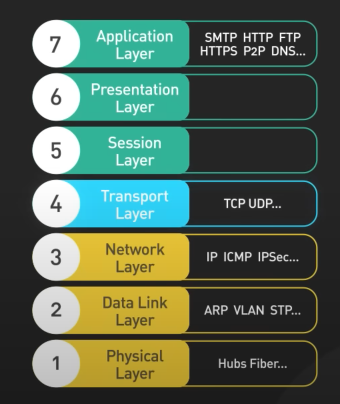

**分层的原因: 为了解耦,以获得更好的拓展性**,从OSI的名字: Open System InterConnect Model-开放系统互连互通模型 
可以看出其设计目的就是为了最大化地让设备自由地接入网络
分层后, 下层为上层以接口的方式提供服务（面向接口） 同层之间以相同的协议来传输数据
每一层只专注于解决一类问题（职责最小化）  符合SOLID原则
从上到下

应用层: 具体的应用  SMTP,FTP,HTTP,P2P等
会话层
表示层

传输层: 解决端到端会话的问题   TCP/UDP协议

网络层: 解决包路由的问题     IP/ICMP协议

数据链路层: 解决 封装成帧、透明传输、差错控制  三个问题;   ARP协议

物理层: 定义引脚电压等 电气信号的标准 典型设备: Hub(集线器)