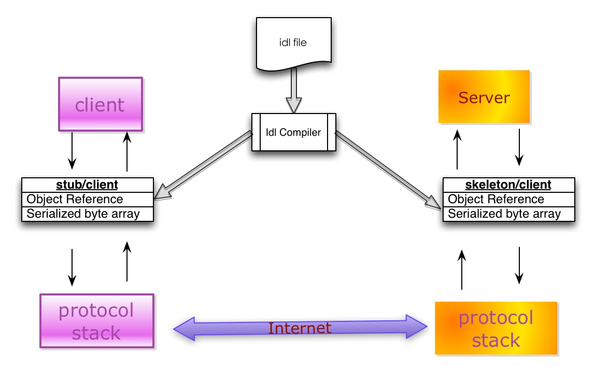

ref: [美团Blog-序列化方案比较](https://tech.meituan.com/2015/02/26/serialization-vs-deserialization.html)

## 实现序列化与反序列化所需组件
典型的序列化和反序列化过程往往需要如下组件：

-   IDL（Interface description language）文件：参与通讯的各方需要对通讯的内容需要做相关的约定（Specifications）。为了建立一个与语言和平台无关的约定，这个约定需要采用与具体开发语言、平台无关的语言来进行描述。这种语言被称为接口描述语言（IDL），采用IDL撰写的协议约定称之为IDL文件。(比如protobuff的.proto文件)

-   IDL Compiler：IDL文件中约定的内容为了在各语言和平台可见，需要有一个编译器，将IDL文件转换成各语言对应的动态库。(编译proto文件的compiler)

-   Stub/Skeleton Lib：负责序列化和反序列化的工作代码。Stub是一段部署在分布式系统客户端的代码，一方面接收应用层的参数，并对其序列化后通过底层协议栈发送到服务端，另一方面接收服务端序列化后的结果数据，反序列化后交给客户端应用层；Skeleton部署在服务端，其功能与Stub相反，从传输层接收序列化参数，反序列化后交给服务端应用层，并将应用层的执行结果序列化后最终传送给客户端Stub。

-   Client/Server：指的是应用层程序代码，他们面对的是IDL所生成的特定语言的class或struct。

-   底层协议栈和互联网：序列化之后的数据通过底层的传输层、网络层、链路层以及物理层协议转换成数字信号在互联网中传递。

## 序列化评价指标
### 性能指标
主要是时空开销
- 时间开销: 序列化与反序列化的速度要快,越快意味着更高的吞吐
- 空间开销: 序列化后的字节流要短, 越短意味着更少的传输时延

### 可读性
可读性意味着易于调试, 如果序列化后的二进制流不可读, 为了调试则必须接入查询平台或提供反序列化程序, 在平时同一个公司内微服务互相调用还好, 如果是跨公司调用则会显得非常麻烦. 这个时候可读性就变得非常重要, 可以大大减少debug的时间;
XML与JSON就有很好的可读性, 但是与之相对的. 其序列化的时空开销巨大

## Benchmark

以下数据来自[https://code.google.com/p/thrift-protobuf-compare/wiki/Benchmarking](https://code.google.com/p/thrift-protobuf-compare/wiki/Benchmarking)

### 时间开销(解析性能)

### 空间开销(序列化后长度)

## 选型建议
1. 性能要求不高, 可读性要求高的 首选json与xml
2. 性能要求高的:  后端是静态语言偏向于protobuff, 动态语言偏向Avro
3. 持久层Hadoop的, 首选Avro

几个候选的序列化方案
- Kryo: [kryo-Github]([EsotericSoftware/kryo: Java binary serialization and cloning: fast, efficient, automatic (github.com)](https://github.com/EsotericSoftware/kryo))
Kryo开箱即用, 速度快序列化后长度小, 唯一的问题:不是线程安全的
想要线程安全, 需要用到ThreadLocal

- Protostuff-runtime
由Protobuf演化而来, Java语言开箱即用, 无需编译

- Hessian
跨语言支持好, 性能稍弱