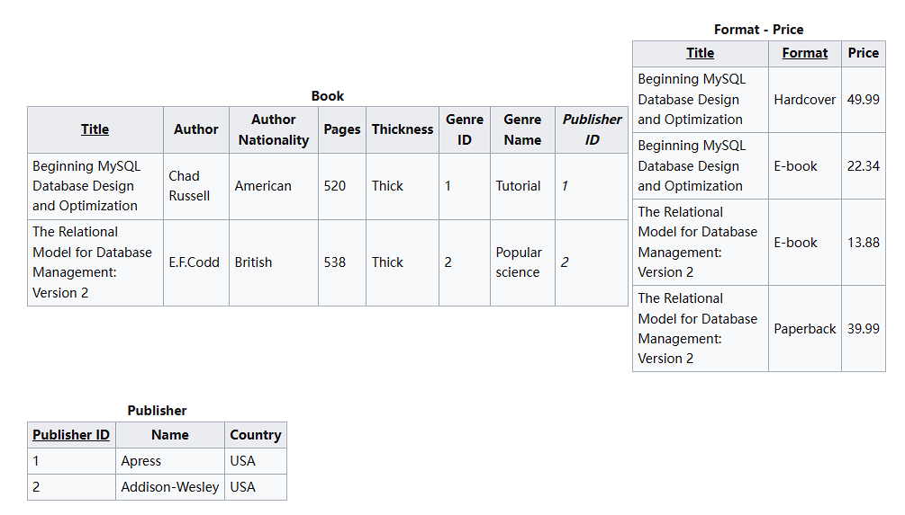

范式Normal Form, 是用来规范化数据库的 主要是为了实现数据库的完整性约束
>完整性约束:
>
>确保数据库里的数据保持准确性/一致性	比如在某表更新了 与之相关联的表也要相应更新;比如对新增的用户,要求其邮箱不能为空

一般而言, 3NF已经足够了;  使用越苛刻的范式,即normalization的程度越高 关系之间的耦合越松, 有新增的实体---表现在数据库里就是一张数据表---

也更容易加入  ; 与之相对的,如果降低范式 那么就会增加耦合度 而好处利用数据的冗余可以省略大量的连接查询, 提高查询速度

## 第一范式

确保表是张二维表即可, 表中的每个列的值 不允许出现集合, 必须是"原子化"的值

> To satisfy [First normal form](https://en.wikipedia.org/wiki/First_normal_form), each column of a table must have a single value. Columns which contain sets of values or nested records are not allowed.

这样的表就不满足1NF

## 第二范式

每一行的非主属性的值  都取决于主键, 则称为符合第二范式

> If a table has a single column primary key, it automatically satisfies 2NF, but if a table has a multi-column or [composite key](https://en.wikipedia.org/wiki/Composite_key) then it may not satisfy 2NF.

比如这张表,  通过composite key {Title,format} 来决定非主属性的值  则不满足2NF, 我们需要对其进行拆解 使得非主属性都可以依赖于单一的主键

通过观察可以看出, 只有Price这个属性是依赖于{Title,Format}的; 其它的属性只依赖于{Title} 而Name与Country属性只依赖于{PublisherID},

则可以拆成如下的表:

## 第三范式

在第二范式的基础上, 消灭传递依赖 则可满足第三范式

比如在上述满足第二范式的拆表中 Book表里 AuthorNationality是依赖于Author的, 而Author又是依赖于主键Title的, 这就不满足3NF

同样的, Genre Name是依赖于Genre ID的 而GenereID又依赖于主键Title 所以也需要对其进行拆解

